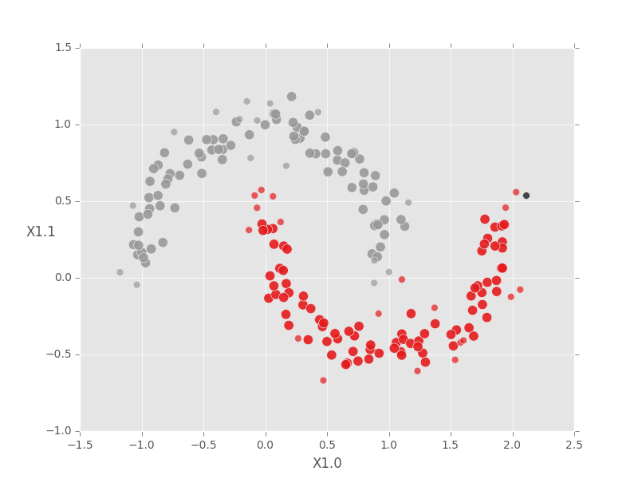
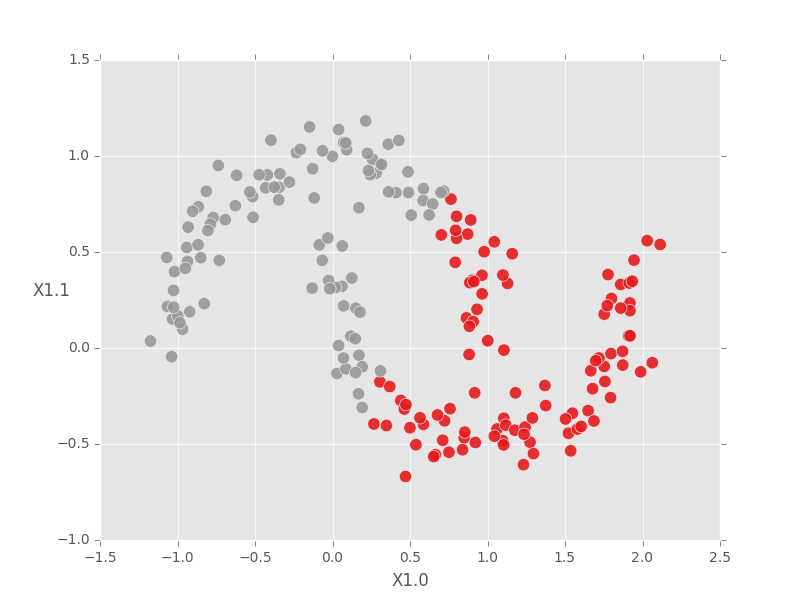

# DBSCAN

**DSBCAN**, short for Density-Based Spatial Clustering of Applications with
Noise, is the most popular density-based clustering method. Density-based
clustering algorithms attempt to capture our intuition that a cluster &mdash; a
difficult term to define precisely &mdash; is a region of the data space where
there are lots of points, surrounded by a region where there are few points.
DBSCAN does this by partitioning the input data points into three types:

- *Core* points have a large number of other points within a given neighborhood. The
  parameter `min_core_neighbors` defines how many points counts as a "large
  number", while the `radius` parameter defines how large the neighborhoods are
  around each point. Specifically, a point $$y$$ is in the neighborhood of point
  $$x$$ if $$d(x, y) < $$ `radius`, where $$d$$ is a user-specified distance
  function.

- *Boundary* points are within distance `radius` of a core point, but don't
  have sufficient neighbors of their own to be considered core.

- *Noise* points comprise the remainder of the data. These points have too
  few neighbors to be considered core points, and are further than distance
  `radius` from all core points.

Clusters are formed by connecting core points that are neighbors of each other,
then assigning boundary points to their nearest core neighbor's cluster. Noise
points are left unassigned.

DBSCAN tends to be slower than K-means because it requires computation of the
similarity graph on the input dataset, but it has several major conceptual
advantages:

- The number of clusters does not need to be known *a priori*; DBSCAN detects the
  optimum number of clusters automatically for the given values of
  `min_core_neighbors` and `radius`.

- DBSCAN recovers much more flexible cluster shapes than K-means, which can only
  find spherical clusters.

- DBSCAN intrinsically finds and labels outliers as such, making it a great tool
  for outlier and anomaly detection.

- DBSCAN works with any distance function. Note that results may be poor for
  distances that do not obey standard properties of distances, i.e. symmetry,
  non-negativity, triangle inequality, and identity of indiscernibles. The
  distances "euclidean", "manhattan", "jaccard", and "levenshtein" will likely
  yield the best results.


#### Basic usage

To illustrate the basic usage of DBSCAN and how the results can differ from
K-means, we simulate non-spherical, low-dimensional data using the scikit-learn
datasets module.

```python
import turicreate as tc
from sklearn.datasets import make_moons

data = make_moons(n_samples=200, shuffle=True, noise=0.1, random_state=19)
sf = tc.SFrame(data[0]).unpack('X1')

dbscan_model = tc.dbscan.create(sf, radius=0.25)
dbscan_model.summary()
```
```no-highlight
Class                                   : DBSCANModel

Schema
------
Number of examples                      : 200
Number of feature columns               : 2
Max distance to a neighbor (radius)     : 0.25
Min number of neighbors for core points : 10
Number of distance components           : 1

Training summary
----------------
Total training time (seconds)           : 0.1954
Number of clusters                      : 2

Accessible fields
-----------------
   cluster_id                           : Cluster label for each row in the input dataset.
```

Like the K-means model, the assignments of points to clusters is in the models'
`cluster-id` field. The second column shows the cluster assignment for the row
index of the input data indicated by the first column. The third column shows
whether DBSCAN considers the point *core*, *boundary*, or *noise*. Noise points
are not assigned to a cluster, which is encoded as a "missing" value in the
'cluster_id' column.

```python
dbscan_model['cluster_id'].head(5)
```
```no-highlight
+--------+------------+------+
| row_id | cluster_id | type |
+--------+------------+------+
|  175   |     1      | core |
|  136   |     0      | core |
|   33   |     1      | core |
|  113   |     0      | core |
|  110   |     1      | core |
+--------+------------+------+
[5 rows x 3 columns]
```

```python
dbscan_model['cluster_id'].tail(5)
```
```no-highlight
+--------+------------+----------+
| row_id | cluster_id |   type   |
+--------+------------+----------+
|   53   |     0      | boundary |
|   4    |     1      | boundary |
|   43   |     0      | boundary |
|  116   |     0      | boundary |
|   74   |    None    |  noise   |
+--------+------------+----------+
[5 rows x 3 columns]
```

Because we generated 2D data, we can plot it and color the points according to
the cluster assignments generated by our DBSCAN model. The first step is to join
the cluster results back to the original data. Please note: DBSCAN scrambles the
row order - be careful!

Next we define boolean masks so we can plot the core, boundary, and noise points
separately. Boundary points are drawn smaller than core points, and
(unclustered) noise points are left black. Some plotting code is omitted for
brevity.

<!-- ax.set_xlabel('X1.0'); ax.set_ylabel('X1.1', rotation=0) -->
```python
import matplotlib.pyplot as plt
plt.style.use('ggplot')

sf = sf.add_row_number('row_id')
sf = sf.join(dbscan_model['cluster_id'], on='row_id', how='left')
sf = sf.rename({'cluster_id': 'dbscan_id'})

core_mask = sf['type'] == 'core'
boundary_mask = sf['type'] == 'boundary'
noise_mask = sf['type'] == 'noise'

fig, ax = plt.subplots()
ax.scatter(sf['X1.0'][core_mask], sf['X1.1'][core_mask], s=80, alpha=0.9,
           c=sf['dbscan_id'][core_mask], cmap=plt.cm.Set1)

ax.scatter(sf['X1.0'][boundary_mask], sf['X1.1'][boundary_mask], s=40,
           alpha=0.7, c=sf['dbscan_id'][boundary_mask], cmap=plt.cm.Set1)

ax.scatter(sf['X1.0'][noise_mask], sf['X1.1'][noise_mask], s=40, alpha=0.7,
           c='black')
fig.show()
```



For comparison, K-means cannot identify the true clusters in this case, even
when we tell the model the correct number of clusters.

<!-- ax.set_xlabel('X1.0'); ax.set_ylabel('X1.1', rotation=0) -->
```python
kmeans_model = tc.kmeans.create(sf, features=['X1.0', 'X1.1'], num_clusters=2)
sf['kmeans_id'] = kmeans_model['cluster_id']['cluster_id']

fig, ax = plt.subplots()
ax.scatter(sf['X1.0'], sf['X1.1'], s=80, alpha=0.9, c=sf['kmeans_id'],
           cmap=plt.cm.Set1)
fig.show()
```




#### Setting key parameters

DBSCAN is particularly useful when the number of clusters is not known *a
priori*, but it can be tricky to set the `radius` and `min_core_neighbors`
parameters. To improve the quality of DBSCAN results, try the following:

- When `radius` is too large or `min_core_neighbors` is too small, every point
  being labeled as a core point, often connected as a single cluster. If your
  created model has a single cluster with only core points (and you suspect this
  is incorrect), try decreasing the `radius` parameter or increasing the
  `min_core_neighbors` parameter.

- Conversely, if DBSCAN labels all points as noise, with no clusters returned at
  all, try increasing the `radius` or decreasing the `min_core_neighbors`.

- Use the Turi Create nearest neighbors toolkit to construct a
  similarity graph on the data and plot the distribution of distances with
  Canvas. This will give you a sense for reasonable values of the `radius`
  parameter, then the `min_core_neighbors` parameter can be tuned by itself for
  optimal results.


#### Choosing the distance function

DBSCAN is not restricted to Euclidean distances. The Turi Create
implementation allows any distance function---including composite distances---to
be used with DBSCAN. This allows for a tremendous amount of flexibility in terms
of data types and tuning for optimal clustering quality. To demonstrate this
flexibility we'll use DBSCAN with Jaccard distance to deduplicate wikipedia
articles.

```python
import turicreate as tc

sf = tc.SFrame.read_csv('wikipedia-data.csv', header=False)
sf.save('wikipedia.sframe')
```

This particular subset of wikipedia has over 72,000 documents; in the interest
of speed for the demo we sample 20% of this. We also preprocess the data by
constructing a bag-of-words representation for each article and trimming out
stopwords. See Turi Create's [text analytics](https://apple.github.io/turicreate/docs/api/turicreate.toolkits.text_analytics.html) and
[SArray](https://apple.github.io/turicreate/docs/api/generated/turicreate.SArray.html)
documentation for more details.

```python
sf_sample = sf.sample(0.2)
sf_sample['word_bag'] = tc.text_analytics.count_words(sf_sample['X1'])
sf_sample['word_bag'] = sf_sample['word_bag'].dict_trim_by_keys(
                                    tc.text_analytics.stopwords(), exclude=True)
```

With our trimmed bag of words representation, Jaccard distance is a natural
choice. For the purpose of deduplication we want to identify points as "core" if
they have any near neighbors at all, so we set `min_core_neighbors` to 1. To
define what we mean by "near" we set the `radius` parameter somewhat arbitrarily
at 0.5; this means that two points are considered neighbors if they share 50% or
more of the words present in either article.

```python
wiki_cluster = tc.dbscan.create(sf_sample, features=['word_bag'],
                                distance='jaccard', radius=0.5,
                                min_core_neighbors=1)
wiki_cluster.summary()
```
```no-highlight
Class                                   : DBSCANModel

Schema
------
Number of examples                      : 14265
Number of feature columns               : 1
Max distance to a neighbor (radius)     : 0.5
Min number of neighbors for core points : 1
Number of distance components           : 1

Training summary
----------------
Total training time (seconds)           : 35.1235
Number of clusters                      : 88

Accessible fields
-----------------
   cluster_id                           : Cluster label for each row in the input dataset.
```

From the model summary we see there are 88 clusters in the set of 14,265
documents. For more detail on the distribution of cluster sizes, we can use the
method.

```python
wiki_cluster['cluster_id']['cluster_id'].sketch_summary()
```
```no-highlight
+--------------------+---------------+----------+
|        item        |     value     | is exact |
+--------------------+---------------+----------+
|       Length       |     14265     |   Yes    |
|        Min         |      0.0      |   Yes    |
|        Max         |      87.0     |   Yes    |
|        Mean        | 32.3243243243 |   Yes    |
|        Sum         |    10764.0    |   Yes    |
|      Variance      | 699.186105024 |   Yes    |
| Standard Deviation | 26.4421274678 |   Yes    |
|  # Missing Values  |     13932     |   Yes    |
|  # unique values   |       88      |    No    |
+--------------------+---------------+----------+

Most frequent items:
+-------+----+----+----+----+----+----+----+----+----+----+
| value | 1  | 10 | 5  | 19 | 9  | 36 | 64 | 62 | 11 | 23 |
+-------+----+----+----+----+----+----+----+----+----+----+
| count | 33 | 29 | 18 | 15 | 14 | 13 | 9  | 7  | 7  | 5  |
+-------+----+----+----+----+----+----+----+----+----+----+

Quantiles:
+-----+-----+-----+------+------+------+------+------+------+
|  0% |  1% |  5% | 25%  | 50%  | 75%  | 95%  | 99%  | 100% |
+-----+-----+-----+------+------+------+------+------+------+
| 0.0 | 1.0 | 1.0 | 10.0 | 24.0 | 55.0 | 80.0 | 86.0 | 87.0 |
+-----+-----+-----+------+------+------+------+------+------+
```

This indicates that of our 14,265 documents, 13,932 are considered noise (i.e.
missing values), which in this context means they have no duplicates. The
largest cluster has 33 duplicate documents! Let's see what they are. To do this
we again need to join the cluster IDs back to our input dataset.

```python
sf_sample = sf_sample.add_row_number('row_id')
sf_sample = sf_sample.join(wiki_cluster['cluster_id'], on='row_id', how='left')
```
```no-highlight
In [98]: sf_sample[sf_sample['cluster_id'] == 1][['X1']].print_rows(10, max_row_width=80, max_column_width=80)
+---------------------------------------------------------------------------------+
|                                        X1                                       |
+---------------------------------------------------------------------------------+
| graceunitedmethodistchurchwilmingtondelaware it was built in 1868 and added ... |
| firstpresbyterianchurchdelhinewyork it was added to the national register of... |
| methodistepiscopalchurchofnorwich it was added to the national register of h... |
| odonelhouseandfarm it was listed on the national register of historic places... |
| saintpaulsepiscopalchurchwatertownnewyork it was listed on the national regi... |
| windsorhillshistoricdistrict it was added to the national register of histor... |
| pepperellcenterhistoricdistrict the district was added to the national regis... |
| eboardmanhouse it was built in 1820 and added to the national register of hi... |
| johnsoutherhouse the house was built in 1883 and added to the national regis... |
| ednastolikerthreedecker it was built in 1916 and added to the national regis... |
+---------------------------------------------------------------------------------+
[33 rows x 1 columns]
```

It seems this cluster captures a set of article stubs that simply list when a
physical structure was build and added to the National Register of Historic
Places.

There are two important caveats regarding distance functions in DBSCAN:

1. DBSCAN computes many pairwise distances. For dense data, Turi Create
   computes some distances much faster than others, namely "euclidean",
   "squared_euclidean", "cosine", and "transformed_dot_product". Other
   distances, as well as all distances with sparse data, may result in longer
   run times.

2. DBSCAN does not explicitly require the standard distance properties
   (symmetry, non-negativity, triangle inequality, and identity of
   indiscernibles) to hold, but it is based on connecting high-density points
   which are *close* to each other into a single cluster. If the specified
   notion of closeness violates the usual distance properties, DBSCAN may yield
   counterintuitive results. We expect to see the most intuitive results with
   "euclidean", "manhattan", "jaccard", and "levenshtein" distances.


#### References and more information

- Ester, M., et al. (1996) [A Density-Based Algorithm for Discovering Clustersin
  Large Spatial Databases with
  Noise](http://www.aaai.org/Papers/KDD/1996/KDD96-037.pdf). In Proceedings of the
  Second International Conference on Knowledge Discovery and Data Mining. pp.
  226-231.

- [Wikipedia - DBSCAN](https://en.wikipedia.org/wiki/DBSCAN)

- [Visualizing DBSCAN
  Clustering](https://www.naftaliharris.com/blog/visualizing-dbscan-clustering/)
