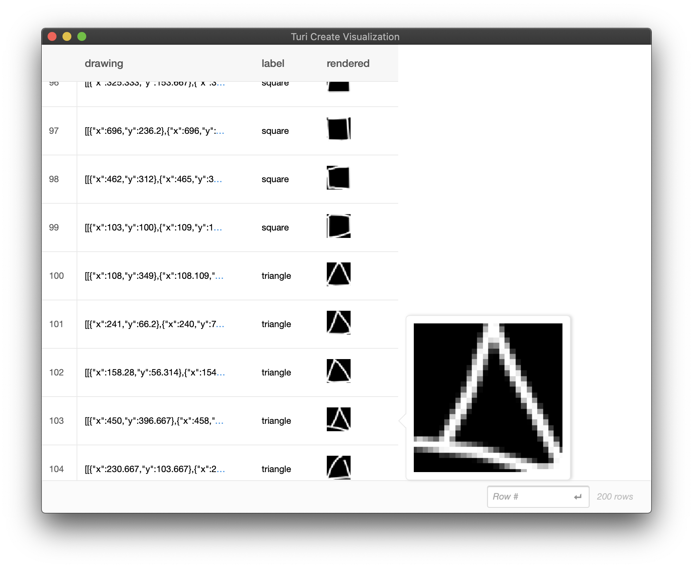

# Quick, Draw! Data Preparation

In this section, we will setup a subset of [Quick, Draw!](https://quickdraw.withgoogle.com/data)<sup>1</sup>. Our goal is to
make a drawing classifier for squares and triangles. 

*Note: Requires Turi Create 5.4 or above*

We start by dowloading a few examples of "square" and "triangle" shapes -- around 120,000 examples each, both as bitmaps and as stroke-based drawings. The following script (run from your terminal) should get you started.

```
# Make directories with the data
mkdir quickdraw
cd quickdraw
mkdir bitmaps strokes sframes

cd bitmaps

# Bitmap data (around 90 MB each)
curl https://storage.googleapis.com/quickdraw_dataset/full/numpy_bitmap/square.npy > square.npy 
curl https://storage.googleapis.com/quickdraw_dataset/full/numpy_bitmap/triangle.npy > triangle.npy

cd ../strokes

# Stroke data (around 200 MB each)
curl https://storage.googleapis.com/quickdraw_dataset/full/raw/square.ndjson > square.ndjson
curl https://storage.googleapis.com/quickdraw_dataset/full/raw/triangle.ndjson > triangle.ndjson
```

After running the above script, you should have a directory structure like this:

```
quickdraw/
    bitmaps/
        square.npy
        triangle.npy
    strokes/
        square.ndjson
        triangle.ndjson
    sframes/

```

For both bitmap and stroke-based drawing input formats, we will sample 100 examples from each of the classes and turn it into an SFrame. 

#### Using Bitmap Data

Here is a snippet to sample 100 examples per class into an SFrame for bitmap data as the input format:

```python
import turicreate as tc
import numpy as np
import os

random_state = np.random.RandomState(100)

# Change if applicable
quickdraw_dir = 'quickdraw'
bitmaps_dir = os.path.join(quickdraw_dir, 'bitmaps')
sframes_dir = os.path.join(quickdraw_dir, 'sframes')
npy_ext = '.npy'
num_examples_per_class = 100
classes = ["square", "triangle"]
num_classes = len(classes)

def build_bitmap_sframe():
    bitmaps_list, labels_list = [], []
    for class_name in classes:
        class_data = np.load(os.path.join(bitmaps_dir, class_name + npy_ext))
        random_state.shuffle(class_data)
        class_data_selected = class_data[:num_examples_per_class]
        class_data_selected = class_data_selected.reshape(
            class_data_selected.shape[0], 28, 28, 1)
        for np_pixel_data in class_data_selected:
            FORMAT_RAW = 2
            bitmap = tc.Image(_image_data = np_pixel_data.tobytes(),
                              _width = np_pixel_data.shape[1],
                              _height = np_pixel_data.shape[0],
                              _channels = np_pixel_data.shape[2],
                              _format_enum = FORMAT_RAW,
                              _image_data_size = np_pixel_data.size)
            bitmaps_list.append(bitmap)
            labels_list.append(class_name)

    sf = tc.SFrame({"drawing": bitmaps_list, "label": labels_list})
    sf.save(os.path.join(sframes_dir, "bitmap_square_triangle.sframe"))

build_bitmap_sframe()
```

After building the two SFrames, your directory structure should look like the
following:
```
quickdraw/
    bitmaps/
        square.npy
        triangle.npy
    strokes/
        square.ndjson
        triangle.ndjson
    sframes/
        bitmap_square_triangle.sframe
        stroke_square_triangle.sframe
```

#### Using Stroke-Based Drawing Data

For stroke-based drawing data to be given as the feature in the input SFrame 
to `turicreate.drawing_classifier.create`, the stroke-based drawing data 
must adhere to the following format:

Each drawing must be represented as a list of strokes, where each stroke must 
be represented as a list of points in the order that they were drawn. 
Each point must be represented as a dictionary with exactly two keys, 
"x" and "y", the values of which must be numerical, i.e. integer or float.
Here is an example of a drawing with two strokes that have five points each:

```python
example_drawing = [
    [
        {"x": 1.0, "y": 2.0},
        {"x": 2.0, "y": 2.0},
        {"x": 3.0, "y": 2.0},
        {"x": 4.0, "y": 2.0},
        {"x": 5.0, "y": 2.0}
    ], # end of first stroke
    [
        {"x": 10.0, "y": 10.0},
        {"x": 10.5, "y": 10.5},
        {"x": 11.0, "y": 11.0},
        {"x": 12.5, "y": 12.5},
        {"x": 15.0, "y": 15.0}
    ]
]
```

Our first task at hand is to build an SFrame that adheres to this format from 
the "Quick, Draw!" data that we have downloaded. 
Here is a snippet to accomplish that:
```python
import turicreate as tc
import numpy as np
import os
import json

random_state = np.random.RandomState(100)

# Change if applicable
quickdraw_dir = 'quickdraw'
strokes_dir = os.path.join(quickdraw_dir, 'strokes')
sframes_dir = os.path.join(quickdraw_dir, 'sframes')
ndjson_ext = '.ndjson'
num_examples_per_class = 100
classes = ["square", "triangle"]
num_classes = len(classes)

def build_strokes_sframe():
    drawings_list, labels_list = [], []
    for class_name in classes:
        with open(os.path.join(strokes_dir, class_name+ndjson_ext)) as fin:
            ndjson_data = list(map(lambda x: x.strip(), fin.readlines()))
        random_state.shuffle(ndjson_data)
        ndjson_data_selected = list(map(json.loads, ndjson_data[:num_examples_per_class]))
        raw_drawing_list = [ndjson["drawing"] for ndjson in ndjson_data_selected]
        def raw_to_final(raw_drawing):
            return [
                [
                    {
                        "x": raw_drawing[stroke_id][0][i], 
                        "y": raw_drawing[stroke_id][1][i]
                    } for i in range(len(raw_drawing[stroke_id][0]))
                ] 
                for stroke_id in range(len(raw_drawing))
            ]

        final_drawing_list = list(map(raw_to_final, raw_drawing_list))
        drawings_list.extend(final_drawing_list)
        labels_list.extend([class_name] * num_examples_per_class)
    sf = tc.SFrame({"drawing": drawings_list, "label": labels_list})
    sf.save(os.path.join(sframes_dir, "stroke_square_triangle.sframe"))

build_strokes_sframe()
```

When stroke-based drawing data is given as input to the Drawing Classifier 
Toolkit either at train or inference time, the toolkit converts the 
stroke-based drawings into bitmaps as part of preprocessing so the 
Neural Network can consume them. See [How it works!](how-it-works.md) for
more information about the preprocessing done under the hood.

To visualize what your stroke-based drawings look like when rendered as a 
bitmap, you can run the following utility function:
```python
sf = build_stroke_sframe()
sf["rendered"] = tc.drawing_classifier.util.draw_strokes(sf["drawing"])
sf.explore()
```


