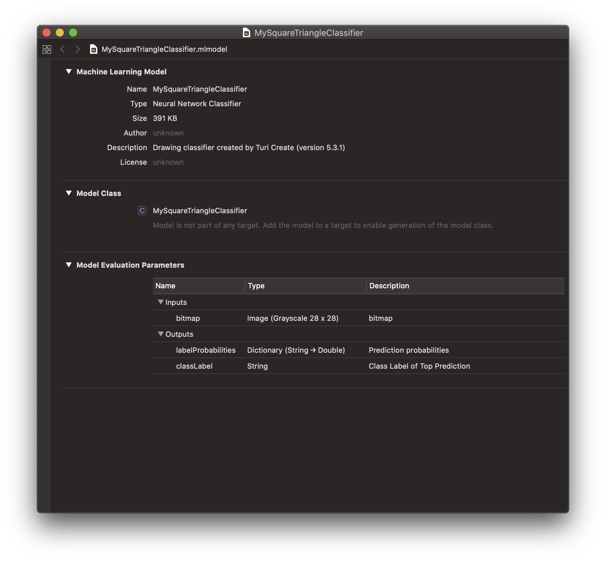

# Deploying to Core ML

Drawing Classifier models created in Turi Create can easily be deployed to
Core ML.

You can export to Core ML in Turi Create 5.4 as follows:
```python
model.export_coreml("MySquareTriangleClassifier.mlmodel")
```

The Core ML Model should look like the following:



Drag and drop `MySquareTriangleClassifier.mlmodel` into your Xcode project and
add it to your app by ticking the appropriate Target Membership check box.

### Inference

Making a prediction at inference time on device is easy! In this section, we go
over your workflow depending on what input you may have in your app at inference
time.

#### Using Bitmap Input

At inference time, if you have access to a bitmap and/or image that represents
the drawing you want to classify, you can use the Vision framework to consume
the exported Core ML model. Note that the image you provide to the Vision API
must be a Grayscale Image. 

```swift
let model = try VNCoreMLModel(for: MySquareTriangleClassifier().model)

let request = VNCoreMLRequest(model: model, completionHandler: { [weak self] request, error in
    self?.processClassifications(for: request, error: error)
})
```

#### Using Stroke-Based Drawing Input

On the other hand, if you have access to raw stroke-based drawing data at 
inference time, you will first have to convert it to a Grayscale Bitmap and then
use the Vision framework so the Core ML model can consume images at inference 
time.

First, convert your stroke-based drawing into a member of the following Drawing 
class using the methods that the following Drawing class exposes.

```swift
import Foundation
import CoreGraphics

class Drawing {
    var drawing: NSMutableArray
    var stroke: NSMutableArray
    var min_x: CGFloat
    var min_y: CGFloat
    var max_x: CGFloat
    var max_y: CGFloat
    
    init() {
        drawing = NSMutableArray()
        stroke = NSMutableArray()
        min_x = CGFloat.greatestFiniteMagnitude
        max_x = 0.0
        min_y = CGFloat.greatestFiniteMagnitude
        max_y = 0.0
    }
    
    func pointCount(stroke i:Int) -> Int {
        let corresponding_stroke = drawing.object(at:i) as! NSArray
        return corresponding_stroke.count
    }
    
    func strokeCount() -> Int {
        return drawing.count
    }
    
    func point(stroke i:Int, point j:Int) -> CGPoint {
        let corresponding_stroke = drawing.object(at:i) as! NSArray
        let answer = corresponding_stroke.object(at:j) as! CGPoint
        return answer
    }
    
    func stroke(index i:Int) -> NSMutableArray {
        return drawing.object(at: i) as! NSMutableArray
    }
    
    func add(point P:CGPoint) {
        let x = P.x
        let y = P.y
        min_x = min(x, min_x)
        max_x = max(x, max_x)
        min_y = min(y, min_y)
        max_y = max(y, max_y)
        stroke.add(P)
    }
    
    func endStroke() {
        let new_stroke = NSMutableArray()
        new_stroke.addObjects(from: stroke as! [Any])
        drawing.add(new_stroke)
        stroke.removeAllObjects()
    }
}

```

Once your stroke-based drawing is a member of the above Drawing class, call the 
`rasterize` function on it to build a 28x28 grayscale bitmap. 
The Core ML model can then run inference on this bitmap via the Vision framework
as described above under "Using Bitmap Input". 

The code snippet containing `rasterize` and its helper, 
`normalize` are provided below.

```swift

func normalize(drawing D:Drawing) -> Drawing {
    let new_drawing = Drawing()
    for i in 0..<D.strokeCount() {
        for j in 0..<D.pointCount(stroke: i) {
            let current_point = D.point(stroke: i, point: j)
            var new_x, new_y : CGFloat
            if (D.max_x == D.min_x) {new_x = D.min_x}
            else {
                new_x = (current_point.x - D.min_x) * 255.0 / (D.max_x - D.min_x)
            }
            if (D.max_y == D.min_y) {new_y = D.min_y}
            else {
                new_y = (current_point.y - D.min_y) * 255.0 / (D.max_y - D.min_y)
            }
            let new_point = CGPoint(x: new_x, y: new_y)
            new_drawing.add(point: new_point)
        }
        new_drawing.endStroke()
    }
    return new_drawing
}

func rasterize(drawing stroke_based_drawing:Drawing) -> CGImage {
    let D = normalize(drawing: stroke_based_drawing)
    let grayscale = CGColorSpaceCreateDeviceGray()
    let intermediate_bitmap_context = CGContext(
        data:nil, width:256, height:256, bitsPerComponent:8, bytesPerRow:0, 
        space:grayscale, bitmapInfo:CGImageAlphaInfo.none.rawValue)
    intermediate_bitmap_context?.setStrokeColor(
        red: 1.0, green: 1.0, blue: 1.0, alpha: 1.0)
    let transform = CGAffineTransform.identity
    let path = CGMutablePath()
    for strokeIndex in 0..<D.strokeCount() {
        let stroke = D.stroke(index: strokeIndex)
        let startPoint = D.point(stroke: strokeIndex, point: 0)
        path.move(to: startPoint, transform: transform)
        for point in stroke {
            path.addLine(to: point as! CGPoint, transform: transform)
        }
    }
    intermediate_bitmap_context?.setLineWidth(20.0)
    intermediate_bitmap_context?.beginPath()
    intermediate_bitmap_context?.addPath(path)
    intermediate_bitmap_context?.strokePath()
    let intermediate_image = intermediate_bitmap_context?.makeImage()
    
    let final_bitmap_context = CGContext(
        data:nil, width:28, height:28, bitsPerComponent:8, bytesPerRow:0, 
        space:grayscale, bitmapInfo:CGImageAlphaInfo.none.rawValue)
    let final_rect = CGRect(x: 0.0, y: 0.0, width: 28.0, height: 28.0)
    final_bitmap_context?.draw(intermediate_image!, in: final_rect)
    return (final_bitmap_context?.makeImage())!
}
```