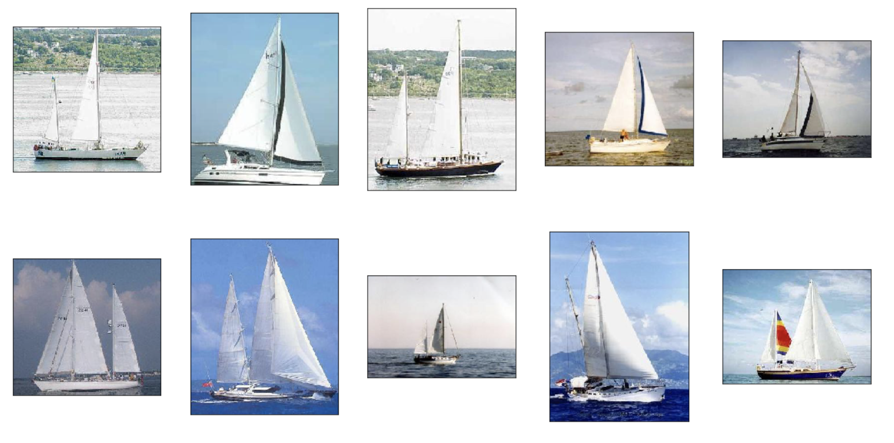

# Image similarity

Given an image, the goal of an image similarity model is to find
"similar" images. Just like in [image
classification](../image_classifier/README.md), deep learning
methods have been shown to give incredible results on this challenging
problem. However, unlike in image similarity, there isn't a need to
generate labeled images for model creation. This model is completely
unsupervised.

#### Creating the model

In this example, we use the [Caltech-101
dataset](http://www.vision.caltech.edu/Image_Datasets/Caltech101/)
which contains images objects belonging to 101 categories with about 40
to 800 images per category.[<sup>1</sup>](../datasets.md)

```python
import turicreate as tc

# Load images from the downloaded data
reference_data  = tc.image_analysis.load_images('./101_ObjectCategories')
reference_data = reference_data.add_row_number()

# Save the SFrame for future use
reference_data.save('./caltech-101.sframe')
```

We can explore the data interactively using:
```python
reference_data.explore()
```

Next, we create an **image similarity** model using the data (commonly
called **reference data**)
```python
model = tc.image_similarity.create(reference_data)
```

#### Querying the model

Once created, we can query the model to retrieve the ten closest images
in the original reference data (by setting the `k` parameter to `10`).
The result of the query method is an SFrame with four columns: query
label, reference label, distance, and rank of the reference point 
among the query point's nearest neighbors.

_Note: You can pass in an image, or an SArray of images into the `model.query`_
_method. This image or array of images does **not** need to be a part of the_
_original dataset._

```python
query_results = model.query(reference_data[0:10], k=10)
query_results.head()
```
```no-highlight
+-------------+-----------------+---------------+------+
| query_label | reference_label |    distance   | rank |
+-------------+-----------------+---------------+------+
|      0      |        0        |      0.0      |  1   |
|      0      |       2557      | 18.3461090355 |  2   |
|      0      |       7000      | 18.3861360371 |  3   |
|      0      |       2664      |  18.655464356 |  4   |
|      0      |       1968      |  18.887705352 |  5   |
|      0      |       7764      | 19.0063301087 |  6   |
|      0      |       4296      | 19.0114573751 |  7   |
|      0      |       221       | 19.1188139256 |  8   |
|      0      |       1361      | 19.1415785143 |  9   |
|      0      |       1148      | 19.1690505999 |  10  |
+-------------+-----------------+---------------+------+
[100 rows x 4 columns]
```

Now, for a simple image like this (let's say the 10th image in the data).
```python
reference_data[9]['image'].show()
```

Note: the loading order of images is non-deterministic, so your 10th image
is likely something differnt but this isn't important for demonstration purposes.

The 10 most "similar" looking images are
```python
similar_rows = query_results[query_results['query_label'] == 9]['reference_label']
reference_data.filter_by(similar_rows, 'id').explore()
```



#### Similarity graph

In some cases, we want to find the most similar images in the reference
dataset for all images in the reference dataset. The similarity_graph
method returns an SGraph whose vertices are the row numbers of the reference
dataset and whose edges indicate a nearest neighbor match. Specifically,
the destination vertex of an edge is a nearest neighbor of the source
vertex. `similarity_graph` can also return results in the same form as the
query method if so desired.

```python
similarity_graph = model.similarity_graph(k=10)
similar_images = similarity_graph.edges
```
```no-highlight
+----------+----------+---------------+------+
| __src_id | __dst_id |    distance   | rank |
+----------+----------+---------------+------+
|   1145   |   3031   | 16.6532360195 |  1   |
|   1145   |   8627   | 16.7883178946 |  2   |
|   1145   |   8559   | 16.9748661517 |  3   |
|   1145   |   238    | 17.6599250835 |  10  |
|   1158   |   4523   | 17.0756179217 |  2   |
|   1161   |   7422   | 16.9777686727 |  2   |
|   1161   |   1203   | 17.1384324655 |  7   |
|   1180   |   6636   | 16.7749244209 |  9   |
|   1182   |   3276   | 16.8179663995 |  5   |
|   1182   |   7717   |  16.889624839 |  6   |
+----------+----------+---------------+------+
[91440 rows x 4 columns]
```

##### Saving the model

Once you have created a model, you can save it and load it back later for use.

```python
model.save('./myModel.model')
loaded_model = turicreate.load_model('./myModel.model')
```

#### Using GPUs

GPUs can make creating an image similarity model much faster. If you have
macOS 10.13 or higher, Turi Create will automatically use the GPU. If
your Linux machine has an NVIDIA GPU, you can setup Turi Create to use
the GPU, [see instructions](https://github.com/apple/turicreate/blob/master/LinuxGPU.md).

The `turicreate.config.set_num_gpus` function allows you to control if GPUs are used:
```python
# Use all GPUs (default)
turicreate.config.set_num_gpus(-1)

# Use only 1 GPU
turicreate.config.set_num_gpus(1)

# Use CPU
turicreate.config.set_num_gpus(0)
```


#### How it works

The key ideas in the image similarity model are similar to those in
[image classifier](../image_classifier/how-it-works.md). When you run
the Turi Create image classifier, it breaks things down into something
like this:

* **Stage 1**: Uses a pre-trained CNN classifier on a large, general
  dataset. A good example is ImageNet, with 1000 categories and 1.2
million images.

* **Stage 2**: The outputs of each layer in the CNN can be viewed as a
  meaningful vector representation of each image. Extract these feature
vectors from the layer prior to the output layer on each image of your
task.

* **Stage 3**: Create a [nearest
  neighbors](../nearest_neighbors/nearest_neighbors.md) model with those
feature vectors as input.

#### References

- [1] L. Fei-Fei, R. Fergus and P.  Perona. One-Shot learning of object
categories. IEEE Trans. Pattern Recognition and Machine Intelligence.
