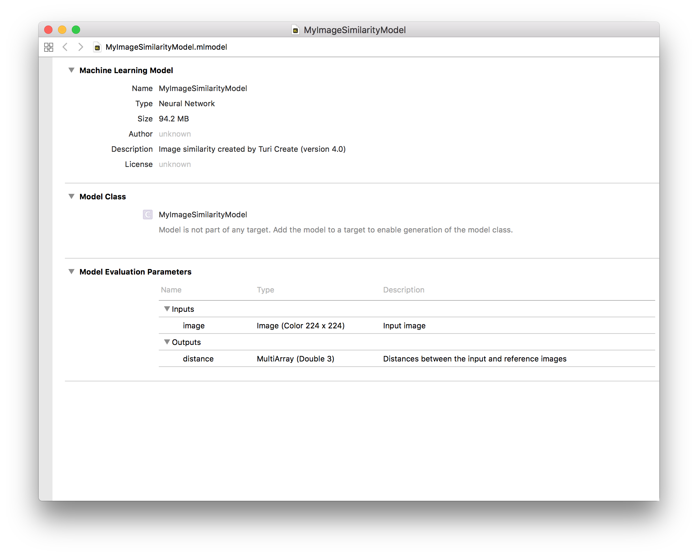

# Deploying to Core ML

Using the Core ML Framework, you can retrieve the distance between a query image and all images in the reference data. Exporting this model in Core ML format can be
performed using the `export_coreml` function.

```python
model.export_coreml('MyImageSimilarityModel.mlmodel')
```

When you open the model in Xcode, it looks like the following:



The following Swift code is needed to consume the model in
an iOS app.

```swift
let model = try VNCoreMLModel(for: MyImageSimilarityModel().model)

let request = VNCoreMLRequest(model: model, completionHandler: { [weak self] request, error in
    self?.processQuery(for: request, error: error)
})
request.imageCropAndScaleOption = .centerCrop
return request
```

Notice that the image similarity model in Core ML returns the distances between the query image and all images in the reference dataset. In order to retrieve the most similar images in the reference dataset, we must sort them by distance. We can do this by modifying the [Core ML sample application
](https://developer.apple.com/documentation/vision/classifying_images_with_vision_and_core_ml) as such:

```swift
func processQuery(for request: VNRequest, error: Error?, k: Int = 5) {
    DispatchQueue.main.async {
        guard let results = request.results else {
            self.referenceRanking.text = "Unable to rank image.\n\(error!.localizedDescription)"
            return
        }

        let queryResults = results as! [VNCoreMLFeatureValueObservation]
        let distances = queryResults.first!.featureValue.multiArrayValue!
        
        // Create an array of distances to sort
        let numReferenceImages = distances.shape[0].intValue
        var distanceArray = [Double]()
        for r in 0..<numReferenceImages {
            distanceArray.append(Double(distances[r]))
        }

        let sorted = distanceArray.enumerated().sorted(by: {$0.element < $1.element})
        let knn = sorted[..<min(k, numReferenceImages)]

        self.referenceRanking.text = String(describing: knn)
    }
}
```