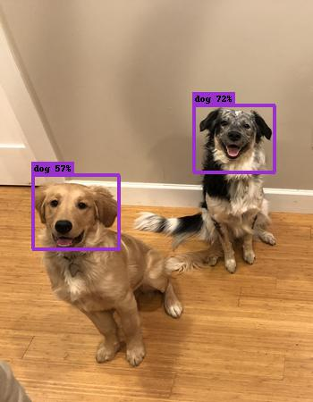
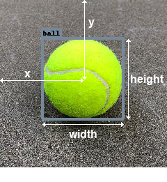
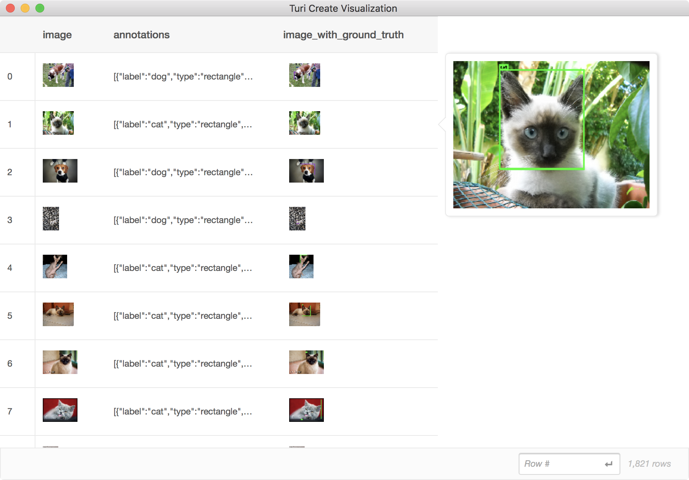
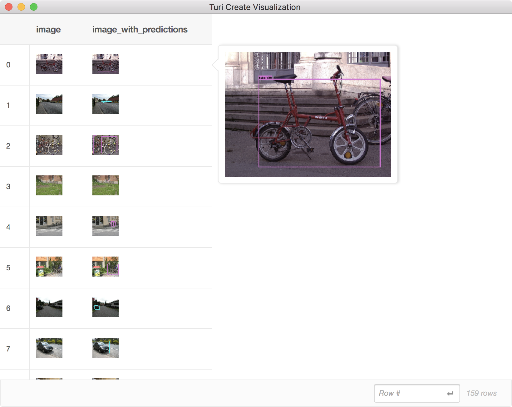

# Object Detection
Object detection is the task of simultaneously classifying (*what*) and
localizing (*where*) object instances in an image. Given an image, a
detector will produce instance predictions that may look something like this:



This particular model was instructed to detect instances of animal faces.
The notion of localization is here provided by bounding boxes around the
instances.

#### Introductory Example

In this example, the goal is to **predict** if there are **bikes or cars** in a
picture and where in the picture they are located (Go to [Data
Preparation](data-preparation.md) to find out how to get `ig02.sframe`).

```python
import turicreate as tc

# Load the data
data =  tc.SFrame('ig02.sframe')

# Make a train-test split
train_data, test_data = data.random_split(0.8)

# Create a model
model = tc.object_detector.create(train_data)

# Save predictions to an SArray
predictions = model.predict(test_data)

# Evaluate the model and save the results into a dictionary
metrics = model.evaluate(test_data)

# Save the model for later use in Turi Create
model.save('mymodel.model')

# Export for use in Core ML
model.export_coreml('MyCustomObjectDetector.mlmodel')
```

#### Data Acquisition

The introductory example creates a model assuming the data already exists, but before we create our model, 
we require labeled data. This data should consist of images and *ground truth*
annotations (correct class label and bounding box for each instance). The more data we
have, the better our predictions will be. Ground truth data should look similar
to prediction data, at least what you hope it will look like. Here is an example:


In this particular example, we chose *ball* and *cup* to be object classes. Each
instance of these objects therefore gets a ground truth bounding box. In this scenario we are not
interested in detecting fruit, so we leave them unmarked. You should decide a
list of object classes of interest, preferably in advance. If you start marking
up all potentially interesting objects in your training images, you may end up with
classes with very few samples. Alternatively, you can annotate as much as you
want and then pass a list of classes to `create` using the `classes` parameter;
object instances not covered in this list will simply be ignored.

The ground truth annotations for the image above should be encoded as a list
of dictionaries, each dictionary representing a single bounding box:

```python
[{'coordinates': {'height': 104, 'width': 110, 'x': 115, 'y': 216},
  'label': 'ball'},
 {'coordinates': {'height': 106, 'width': 110, 'x': 188, 'y': 254},
  'label': 'ball'},
 {'coordinates': {'height': 164, 'width': 131, 'x': 374, 'y': 169},
  'label': 'cup'}]
```

You may optionally include `'type': 'rectangle'` to explicitly denote these as
bounding boxes. If `type` is defined as something else, the object detector
will ignore that dictionary.  A bounding box is defined by four values (*x*,
*y*, *width*, *height*) where (0, 0) is the top left corner. The center of the
box is located at (*x*, *y*):



It is customary for bounding boxes to tightly surround instances. However, this
is only a convention and it is entirely up to you and your training data to
define how instances should be represented as boxes. If you for instance only need to
predict the center of objects, feel free to set all widths/heights to a
token value (e.g. 100) in your training data.

It is up to you to choose how many bounding boxes you define for each image.
However, try to be consistent with your notion of instances. If you are trying
to detect persons, then every occurrence of a person should warrant a ground
truth bounding box. If you leave some persons unmarked, the model can get
confused why some persons are marked as positives (presence of an instance)
while others are marked as negatives (absence of an instance). If you want, you
may include images without any bounding boxes whatsoever (pure negatives),
granted that no instances appear in those images. This can be an effective way
of reducing false positives. For instance, if you train a model to detect balls
and the training set you provide never includes other round objects, you may
find that your model starts assigning high confidence of *ball* to other
similar objects. In the photo above, the presence of an apple and a clementine
may actually help to prevent such mistakes, even though they are not marked up
explicitly.

The lists of bounding boxes should be placed inside an SFrame alongside the
images:

```python
+------------------------+-------------------------------+
|         image          |          annotations          |
+------------------------+-------------------------------+
| Height: 375 Width: 500 | [{'coordinates': {'y': 204... |
| Height: 375 Width: 500 | [{'coordinates': {'y': 148... |
| Height: 334 Width: 500 | [{'coordinates': {'y': 146... |
| Height: 500 Width: 345 | [{'coordinates': {'y': 321... |
| Height: 480 Width: 500 | [{'coordinates': {'y': 301... |
| Height: 375 Width: 500 | [{'coordinates': {'y': 121... |
| Height: 335 Width: 500 | [{'coordinates': {'y': 119... |
| Height: 335 Width: 500 | [{'coordinates': {'y': 150... |
| Height: 500 Width: 333 | [{'coordinates': {'y': 235... |
| Height: 333 Width: 500 | [{'coordinates': {'y': 120... |
+------------------------+-------------------------------+
[1821 rows x 2 columns]
```

When arranging your data, keep in mind that the model can be quite literal in
its interpretation of the task. Please keep these following considerations in mind:

 1. The data should be varied. Use many photos of your object instances in
    different contexts, from a variety of angles and scales, lighting
    conditions, etc. If you only have photos of your object from the same pose
    (e.g. person facing the camera), then at test time it will likely fail to
    make a detection if a different pose is presented (e.g. person looking
    away). Unless you specifically want the detector to have such behavior, you
    will need to vary the pose in your training data. If you use broad categories
    of objects, such as a *cup* or *dog*, include a wide variety of types of cups
    and breeds of dogs.

 2. The ground truth data should be representative of the actual use case data. For instance,
    if you take photos of a catalog of products only inside a warehouse, it may not
    work well if your users are making predictions inside a store.

You can expect to need at least 30 samples (bounding boxes) per object class,
but even that will be too few for many challenging tasks. For high quality
results, plan to have closer to 200 samples per class.

Once you have arranged your data, it is worth visually checking that the bounding boxes
match your expectations:

```python
data['image_with_ground_truth'] = \
    tc.object_detector.util.draw_bounding_boxes(data['image'], data['annotations'])
data.explore()
```



#### Model Creation
Once the ground truth data is ready, creating the model is easy:

```python
model = tc.object_detector.create(data, feature='image', annotations='annotations')
```

Model creation may take time. If you do not have access to a GPU, it can take
as much as a day to train a good model. Progress will be continuously printed to
give you a sense of the time it will take. The number of training iterations is
determined automatically based on the size of your dataset. If you want to
lower this value to make model creation faster, you can change it by manually
passing `max_iterations` to `create`.  This may lead to a model with inferior
prediction results. To know for sure, we will soon discuss how to do
quantitative model evaluation. Before that, let us make some predictions on
images so far unseen by the model.

#### Making Predictions

If `images` is a list of `tc.Image` instances, we can make predictions:

```python
test = tc.SFrame({'image': images})
test['predictions'] = model.predict(test)
```

The new column with predictions is in the same format as ground truth
annotations. The only difference is that the bounding box dictionaries now
include an entry for prediction confidence:

```python
[{'confidence': 0.7225357099539148,
  'coordinates': {'height': 73.92794444010806,
                  'width': 90.45315889211807,
                  'x': 262.2198759929745,
                  'y': 155.496952970812},
  'label': 'dog',
  'type': 'rectangle'},
 {'confidence': 0.5670584769557776,
  'coordinates': {'height': 82.3002741887019,
                  'width': 96.48565420737631,
                  'x': 85.07887845066891,
                  'y': 237.6466784964736},
  'label': 'dog',
  'type': 'rectangle'}]
```

You can also use the same function that we used to visualize the ground truth
annotations to visually inspect our predictions:

```python
test['image_with_predictions'] = \
    tc.object_detector.util.draw_bounding_boxes(test['image'], test['predictions'])
test[['image', 'image_with_predictions']].explore()
```



Another useful way to inspect predictions is to convert them to *stacked
format*, which is an SFrame where each row represents a bounding box (see
[Advanced Usage](advanced-usage.md#stacked)).

#### Evaluation

In image classification, an evaluation score of 90% *accuracy* means we can
expect the model to make the correct prediction in 9 out of 10 images. For
object detection we report *mean average precision* (mAP), which is not nearly
as intuitive. The main take aways of using this metric are:

 - It is a value between 0 and 1 (or 0% and 100%), with higher being better.
 - Use the quantitative metric primarily as a relative measure between different
   models (training time, sample size, etc.). A single value will not give you
   a sense of whether or not the detector is good enough for your use case.
   Rely on qualitative prediction examples for that. However, if you train
   a new model that improves your mAP metric from 47% to 55%, you know that
   the new model is stronger without having to look through images and make a
   difficult judgement call.

We describe this metric in more detail in the [Advanced
Usage](advanced-usage.md) section, where we also cover using Core ML
to deploy your detector to iOS and macOS:
