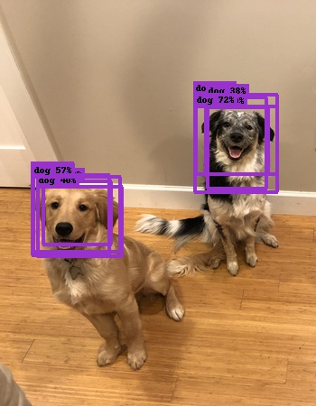

# Deploying to Core ML

Object detector models created in Turi Create can easily be deployed to
Core ML.

#### Deployment for iOS 12 and macOS 10.14 (Turi Create 5)

With Turi Create 5.0+ and starting in iOS 12, macOS 10.14 you can
directly integrate object detector models via the [Vision
Framework](https://developer.apple.com/documentation/vision)


You can export to Core ML in Turi Create 5 as follows:
```python
model.export_coreml('MyDetector.mlmodel')
```

```swift
let mlmodel = MyDetector()
let visionModel = try VNCoreMLModel(for: mlmodel.model)
let objectRecognition = VNCoreMLRequest(model: visionModel,
                                        completionHandler: { (request, error) in
    guard let results = request.results else { return }

    for case let foundObject as VNRecognizedObjectObservation in results {
        let bestLabel = foundObject.labels.first! // Label with highest confidence
        let objectBounds = foundObject.boundingBox

        // Use the computed values.
        print(bestLabel.identifier, bestLabel.confidence, objectBounds)
    }
})
objectRecognition.imageCropAndScaleOption = .scaleFill
```

For more details on the integration with Core ML and a sample app to get
you started, please look at the the article on
[Recognizing Objects in Live Capture](https://developer.apple.com/documentation/vision/recognizing_objects_in_live_capture).

**Note:** Only models that were exported with *non-maximum suppression* (the default
behavior in Turi Create 5.0+) will work with this example app. Older models
or models that specify `include_non_maximum_suppression=False` will not give
results as `VNRecognizedObjectObservation` objects and instead as
`VNCoreMLFeatureValueObservation` objects; these are silently ignored in
this example app. To learn how to work with `VNCoreMLFeatureValueObservation`
objects, please continue reading.

#### Deployment for iOS 11 and  macOS 10.13

To deploy the object detector in apps for iOS 11 and macOS 10.13, you
need a few extra steps (these have been incorporated into iOS 12 and
macOS 10.14).

You can export to Core ML in Turi Create 5 as follows:
```python
model.export_coreml('MyDetector.mlmodel', include_non_maximum_suppression=False)
```
and with Turi Create 4 you can do
```python
model.export_coreml('MyDetector.mlmodel')
```

This Core ML model takes an image and outputs two matrices of floating
point values, *confidence* and *coordinates*. The first one has shape
N-by-C, where N is the maximum number of bounding boxes that can be
returned in a single image, and C is the number of classes. If you index
this at *(n, c)*, you get the confidence of the *n*:th bounding box for
class *c*. The other output, *coordinates*, is N-by-4 and contains [*x*,
*y*, *width*, *height*] coordinates for each bounding box. The
coordinates are expressed relative to the original input size as values
between 0 and 1. This is because it does not know the size before it was
resized to fit the neural network. To get pixel values as in Turi
Create, you have to multiply *x* and *width* by the original width *y*
and *height* by the original height. Note that *x* and *y* refer to the
center of the box.

Drag and drop `MyDetector.mlmodel` into your Xcode project and add it to
your app by ticking the appropriate Target Membership check box. An
arrow next to MyDetector should appear:


Useful meta data is stored inside the model, such as class labels:

```swift
let mlmodel = MyDetector()
let userDefined: [String: String] = mlmodel.model.modelDescription.metadata[MLModelMetadataKey.creatorDefinedKey]! as! [String : String]
let labels = userDefined["classes"]!.components(separatedBy: ",")
```

The order of `labels` corresponds to the *confidence* output. The meta data
also contains a third type of threshold that we have yet to discuss:
`non_maximum_suppression_threshold`:

```swift
let nmsThreshold = Float(userDefined["non_maximum_suppression_threshold"]!) ?? 0.5
```

Before we discuss how to use this threshold, we must first make a prediction.

##### Prediction

Making a prediction is easy:

```swift
let model = try VNCoreMLModel(for: mlmodel.model)

let request = VNCoreMLRequest(model: model, completionHandler: { [weak self] request, error in
    self?.processClassifications(for: request, error: error)
})
request.imageCropAndScaleOption = .scaleFill
```

We use `.scaleFill` that stretches the image into the native input size of the
model. If you use `.centerCrop` or `.scaleFit`, it will be a bit tricker to
correctly map the bonding box coordinate system to the original input image.

From the `request` results we get two `MLMultiArray` instances,
`coordinates` and `confidence`. For easier handling, we will convert these
results into an array of the following `struct`:

```swift
struct Prediction {
    let labelIndex: Int
    let confidence: Float
    let boundingBox: CGRect
}
```

While building an array of these, we might as well trim the list of predictions
by enforcing a minimum confidence threshold. This threshold is entirely up to
you and your user experience and corresponds to the `confidence_threshold`
parameter in `predict` inside Turi Create:

```swift
let results = request.results as! [VNCoreMLFeatureValueObservation]

let coordinates = results[0].featureValue.multiArrayValue!
let confidence = results[1].featureValue.multiArrayValue!

let confidenceThreshold = 0.25
var unorderedPredictions = [Prediction]()
let numBoundingBoxes = confidence.shape[0].intValue
let numClasses = confidence.shape[1].intValue
let confidencePointer = UnsafeMutablePointer<Double>(OpaquePointer(confidence.dataPointer))
let coordinatesPointer = UnsafeMutablePointer<Double>(OpaquePointer(coordinates.dataPointer))
for b in 0..<numBoundingBoxes {
    var maxConfidence = 0.0
    var maxIndex = 0
    for c in 0..<numClasses {
        let conf = confidencePointer[b * numClasses + c]
        if conf > maxConfidence {
            maxConfidence = conf
            maxIndex = c
        }
    }
    if maxConfidence > confidenceThreshold {
        let x = coordinatesPointer[b * 4]
        let y = coordinatesPointer[b * 4 + 1]
        let w = coordinatesPointer[b * 4 + 2]
        let h = coordinatesPointer[b * 4 + 3]

        let rect = CGRect(x: CGFloat(x - w/2), y: CGFloat(y - h/2),
                          width: CGFloat(w), height: CGFloat(h))

        let prediction = Prediction(labelIndex: maxIndex,
                                    confidence: Float(maxConfidence),
                                    boundingBox: rect)
        unorderedPredictions.append(prediction)
    }
}
```
This gives us an array of predictions (`unorderedPredictions`), still in no
particular order. This array contains more predictions than returned by
`predict` in Turi Create, since we are still missing a post-processing step
called *non-maximum suppression*.

##### Non-maximum suppression

This step is performed automatically by `predict` in Turi Create, but it
is not performed inside the Core ML inference model, so we will have to
add it ourselves. The model is prone to predict multiple similar
predictions associated with a single object instance. Here are the
results of the two dogs without non-maximum suppression:



The algorithm is simple: Start by taking your highest-confidence prediction and
add it to your final list of predictions.
Check the IoU (see [Evaluation](#evaluation)) between it and and all the remaining
predictions. Remove (or *suppress*) any prediction with an IoU above a
pre-determined threshold (the `nmsThreshold` we extracted from the meta data).
Repeat this procedure, now excluding predictions that you have already added
or removed. Here is a reference implementation:

```swift
# Array to store final predictions (after post-processing)
var predictions: [Prediction] = []
let orderedPredictions = unorderedPredictions.sorted { $0.confidence > $1.confidence }
var keep = [Bool](repeating: true, count: orderedPredictions.count)
for i in 0..<orderedPredictions.count {
    if keep[i] {
        predictions.append(orderedPredictions[i])
        let bbox1 = orderedPredictions[i].boundingBox
        for j in (i+1)..<orderedPredictions.count {
            if keep[j] {
                let bbox2 = orderedPredictions[j].boundingBox
                if IoU(bbox1, bbox2) > nms_threshold {
                    keep[j] = false
                }
            }
        }
    }
}
```

The intersection-over-union can be computed as:

```swift
public func IoU(_ a: CGRect, _ b: CGRect) -> Float {
    let intersection = a.intersection(b)
    let union = a.union(b)
    return Float((intersection.width * intersection.height) / (union.width * union.height))
}
```

The array `predictions` is now the final array of predictions corresponding
to what `predict` returns in Turi Create.
