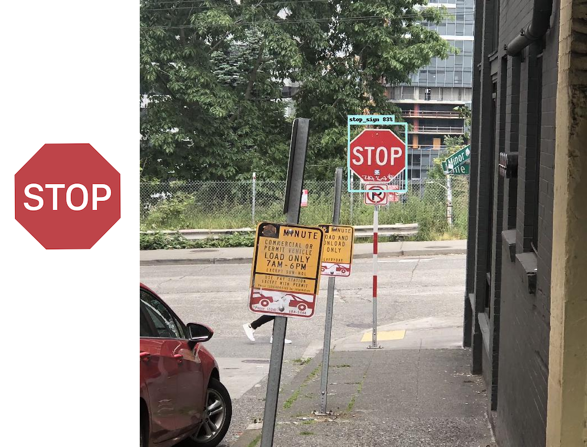
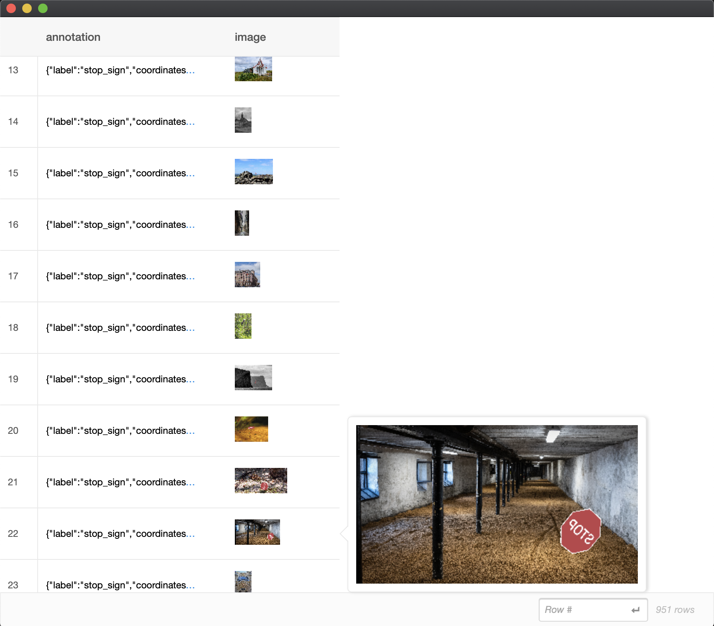
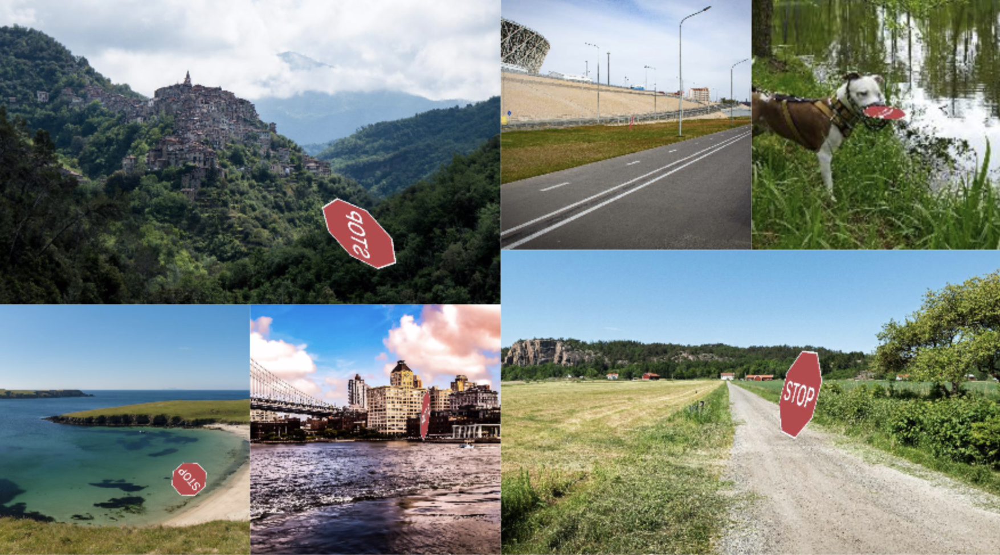
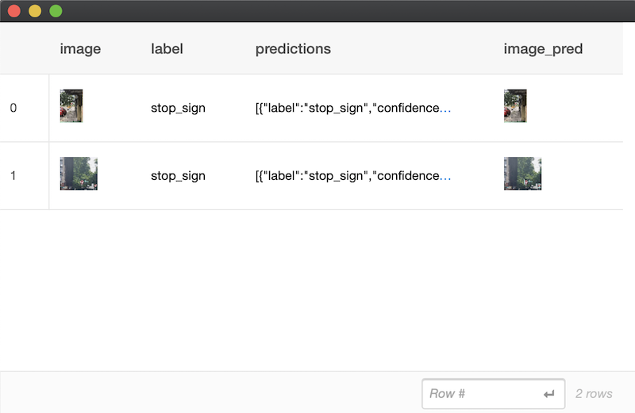
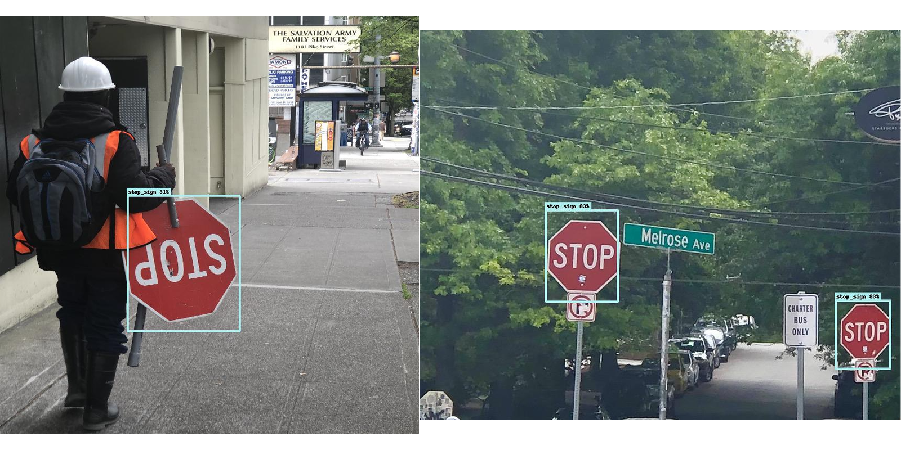

# One-Shot Object Detection

One-Shot object detection is the task of learning to detect from as few as one example per category. Unlike the Object Detector which requires many varied examples of objects in the real world, the One-Shot detector only requires a single canonical example of an object to train the classifier on and performs predictions for that category in the wild. It is best suited for 2D objects such as playing cards, logos, road signs and clapperboards, in a 3D environment. One-Shot detctor is not suitable for 3D objects such as faces, animals and cars. 

Given an image and a one-shot detector trained on category 'stop sign', the output prediction will look like:

 


#### Introductory Example

In this example, the goal is to **localize** where in the image instances of the category **stop sign** are present. For this task we supply a single image of a stop sign as a starter image:


```python
import turicreate as tc

# Load the starter images
starter_images = tc.SFrame({'image':[tc.Image('stop_sign.png')],
                   'label':['stop_sign']})

# Load test images
test_data = tc.SFrame({'image':[tc.Image('stop_sign_photo1.png'), 
                                tc.Image('stop_sign_photo2.png')],
                        'label':['stop_sign', 'stop_sign']})

# Create a model                                      
model = tc.one_shot_object_detector.create(starter_images, 'label')

# Save predictions on the test set as a column in the SFrame
test_data['predictions'] = model.predict(test_data)

# Draw prediction bounding boxes on the test images
test_data['image_pred'] = tc.object_detector.util.draw_bounding_boxes(test_data['image'], test_data['predictions']) 

# Evaluate the model and save the results in a dictionary
metrics = model.evaluate(test_data)

# Save the model for later use in TuriCreate
model.save('mymodel.model')

# Export for use in Core ML
model.export_coreml('MyCustomOneShotDetector.mlmodel')
```

Previewing the synthetic images generated for training is useful to gauge the kind of test images the model would be trained to handle. We can preview the augmented images generated and used by the model for training as follows:  


```python
augmented_images = tc.one_shot_object_detector.util.preview_synthetic_training_data(starter_images, 'label')

augmented_images.explore()
```



Some examples of synthetic training data generated:



*Note: In order to view the exact augmented images used to train the model, the same seed should be used which was used to train the model.*


To visualize the predictions made on the test set:


```python
test_data['image_pred'] = tc.object_detector.util.draw_bounding_boxes(test_data['image'], test_data['predictions'])

test_data.explore()
```



Examples of test image predictions:




#### How it works

To begin training for one-shot object detector, a set of synthetic training data needs to be generated using the provided starter training image(s). These images are augmented with operations: horizontal flip, vertical flip, yaw, pitch, roll, blur, noise and lightening perturbations. These operations are applied on a set of background images. The background images may be provided by the user. If no background images are provided, a set of default background images are downloaded and used.

To learn more about the training implementation details, refer to the Object Detector: How it Works (https://apple.github.io/turicreate/docs/userguide/object_detection/how-it-works.html) chapter.


#### Deployment to CoreML

To learn more about deploying One-Shot to CoreML details, refer to the Object Detector: Deployment to Core ML (https://apple.github.io/turicreate/docs/userguide/object_detection/export-coreml.html) chapter.


#### Advanced Usage

**Background images**

The One-Shot Object Detector generates a set of synthetic images with which to train the detector. These images contain the object in various transformations in the wild. When the network is trained with these images, it allows the model to learn to identify the object in different environments. For convenience, we provide a set of background images by default. However, you may also supply your own custom background images specific to your application. These can be supplied within the `create()` method as follows:    

```python
import turicreate as tc

# Load the starter images
starter_images = tc.SFrame({'image':[tc.Image('stop_sign.png')],
                   'label':['stop_sign']})

# Load background images
my_backgrounds = tc.SArray('my_custom_backgrounds.sarray')

# Create a model using custom background images
# The time to train a model with                                       
model = tc.one_shot_object_detector.create(starter_images, 'label', backgrounds = my_backgrounds)
```

To view the synthetic images generated with your custom background images:

```python
augmented_images = tc.one_shot_object_detector.util.preview_synthetic_training_data(starter_images, 'label', my_backgrounds)

augmented_images.explore()
```

*Note: In order to view the exact augmented images used to train the model, the same seed should be used which was used to train the model.*
