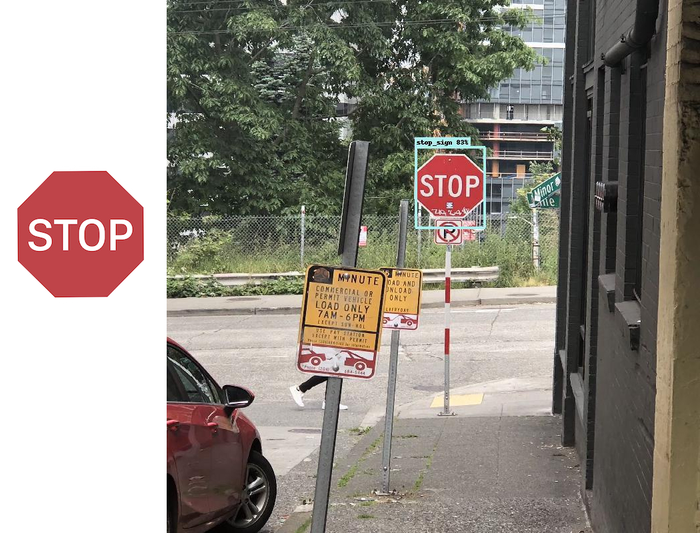
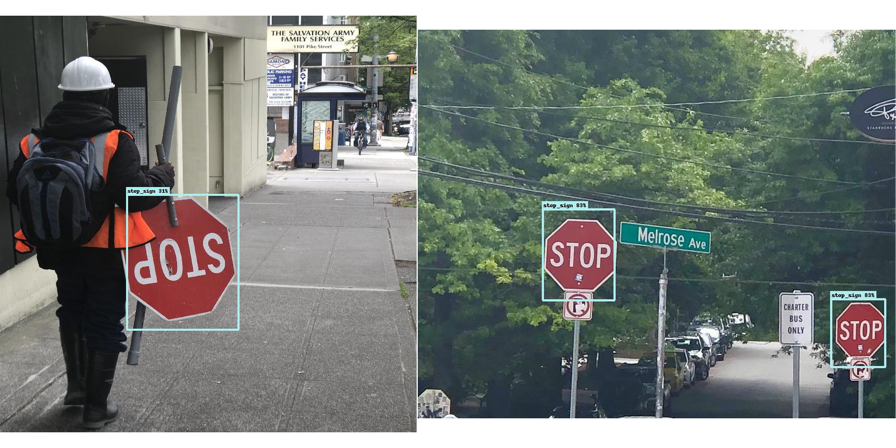
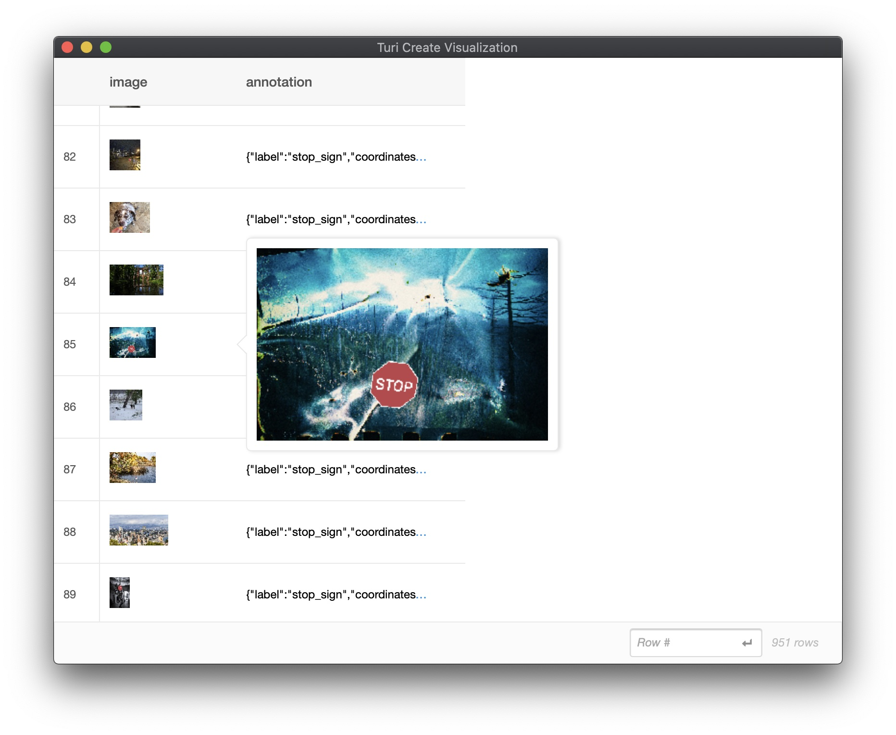
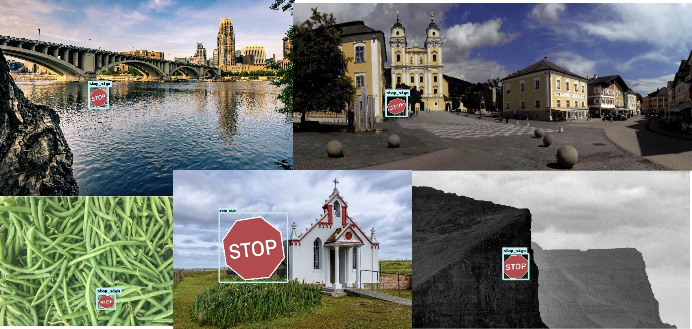

# One-Shot Object Detection

One-Shot object detection (OSOD) is the task of detecting an object from as little as **one** example per category. Unlike the [Object Detector](https://apple.github.io/turicreate/docs/userguide/object_detection) which requires many varied examples of objects in the real world, the One-Shot Object Detector requires a very small (sometimes even just one) canonical example of the object. The One-shot Object Detector is best suited for two-dimensional objects that have some regularity in the wild. Examples include road signs, logos, playing cards, and clapperboards. The One-Shot Object Detector is not suitable for three-dimensional objects like faces, animals, and cars -- such objects are better suited for the classical [Object Detector](https://apple.github.io/turicreate/docs/userguide/object_detection). 

## Introductory Example

In this example, our goal is to **localize** instances of **stop signs** in images. To train a model for this application, we supply a single image of a stop sign as a starter image.

Given a starter image (*left*), a one-shot object detector trained on this starter image will produce instance predictions on a test image (*right*) which may look like this:

 

Download the [stop_sign_starter.png](images/stop_sign_starter.png) image. Also Download [stop_sign_test1.jpg](images/stop_sign_test1.jpg) and [stop_sing_test2.jpg](images/stop_sign_test2.jpg)

```python
import turicreate as tc

# Load the starter images
starter_images = tc.SFrame({'image':[tc.Image('stop_sign_starter.png')],
                   'label':['stop_sign']})

# Load test images
test_images = tc.SFrame({'image':[tc.Image('stop_sign_test1.jpg'), 
                                  tc.Image('stop_sign_test2.jpg')]})

# Create a model. This step will take a few hours on CPU and about an hour on GPU
model = tc.one_shot_object_detector.create(starter_images, 'label')

# Save predictions on the test set
test_images['predictions'] = model.predict(test_images)

# Draw prediction bounding boxes on the test images
test_images['annotated_predictions'] = \
    tc.one_shot_object_detector.util.draw_bounding_boxes(test_images['image'],
        test_images['predictions']) 

# To visualize the predictions made on the test set
test_images.explore()

# Save the model for later use in TuriCreate
model.save('mymodel.model')

# Export for use in Core ML
model.export_coreml('MyCustomOneShotDetector.mlmodel')
```


Examples of test image predictions:




## Deployment to CoreML

To learn more about deploying One-Shot to CoreML details, refer to the [Object Detector: Deployment to Core ML](https://apple.github.io/turicreate/docs/userguide/object_detection/export-coreml.html) chapter.


## How it works

In this section, we will go into detail on what happens under the hood of the `create` method. A One-Shot Object Detector model is trained in two steps. First, the starter image(s) is used to generate synthetic data and annotations. Second, we train an object detector model on the generated synthetic data.

**Stage 1: Automatic synthetic data generation**

To begin training, the provided starter image(s) are used to generate a set of synthetic training data. 
The synthetic images are generated by applying yaw, pitch, and roll rotations on a set of background images. If no background images are provided, a set of default background images are automatically downloaded and used.

**Stage 2: Train the Object Detector model**

To learn about the training implementation details, refer to the [Object Detector: How it Works](https://apple.github.io/turicreate/docs/userguide/object_detection/how-it-works.html) chapter.

## Troubleshooting

Here is a collection of some known caveats and their respective workarounds while using One-Shot Object Detection.

##### My starter image can appear upside down as well as rotated 90 degrees in the wild. Is there anything I can do to improve the quality of the model?

To ensure a higher quality model, instead of providing *one* starter image, feel free to provide *more than one* starter images. For every starter image, we rotate the starter image by up to 20 degrees. As a result, to detect both inverted and erect projections of the same starter image, you can provide *2* starter images with the same label. Here is an example to rotate a Stop Sign starter image by 90 degrees, 180 degrees, and 270 degrees, and construct an SFrame with four starter images:

```python
import turicreate as tc

def pil_to_tc(pil_image):
    pixel_data = np.array(pil_image)
    FORMAT_RAW = 2
    return tc.Image(_image_data=pixel_data.tobytes(),
                    _width=pixel_data.shape[1],
                    _height=pixel_data.shape[0],
                    _channels=pixel_data.shape[2],
                    _format_enum=FORMAT_RAW,
                    _image_data_size=pixel_data.size)

image_path = # set image path here
tc_image = tc.Image(image_path)
pil_image = Image.open(image_path)
images = [tc_image]
for rotation_angle in [90, 180, 270]:
    rotated = pil_to_tc(pil_image.rotate(rotation_angle, expand=True))
    images.append(rotated)

starter_images = tc.SFrame({
    'image': images,
    'label': ['my_label'] * 4
})
```

##### While training with the default backgrounds, my starter image does not appear in most of the images in the synthetic data.

This is a known issue ([#2341](https://github.com/apple/turicreate/issues/2341)) that we're trying to fix. As a workaround, please try resizing your starter image (while preserving the aspect ratio of the starter image) to get it as close to `500x500` (for the default backgrounds) as possible. You can leverage the following API provided by `turicreate.Image`:

```python
image = turicreate.Image('starter.png')
turicreate.image_analysis.resize(image, width=image.width//2, height=image.height//2, channels=image.channels)
```

## Advanced Usage

### Background Images

You can preview the synthetic images the toolkit generates by calling the `preview_synthetic_training_data` utility. This helps you understand data the model would be trained on:  


```python
synthetic_images = \
tc.one_shot_object_detector.util.preview_synthetic_training_data(starter_images, 'label')

synthetic_images.explore()
```



Some examples of synthetic training data:




*Note: In order to view the exact synthetic images used to train the model, the same seed should be used which was used to train the model.*

While we provide a set of background images by default, you can use your own custom background images (specific to your application) as follows:    

```python
# Load background images
my_backgrounds = tc.SArray('my_custom_backgrounds.sarray')

# Create a model using custom background images                                    
model = tc.one_shot_object_detector.create(starter_images, 'label', backgrounds=my_backgrounds)
```

To preview the synthetic images generated with your custom background images:

```python
synthetic_images = \
tc.one_shot_object_detector.util.preview_synthetic_training_data(starter_images, 'label', my_backgrounds)
```
