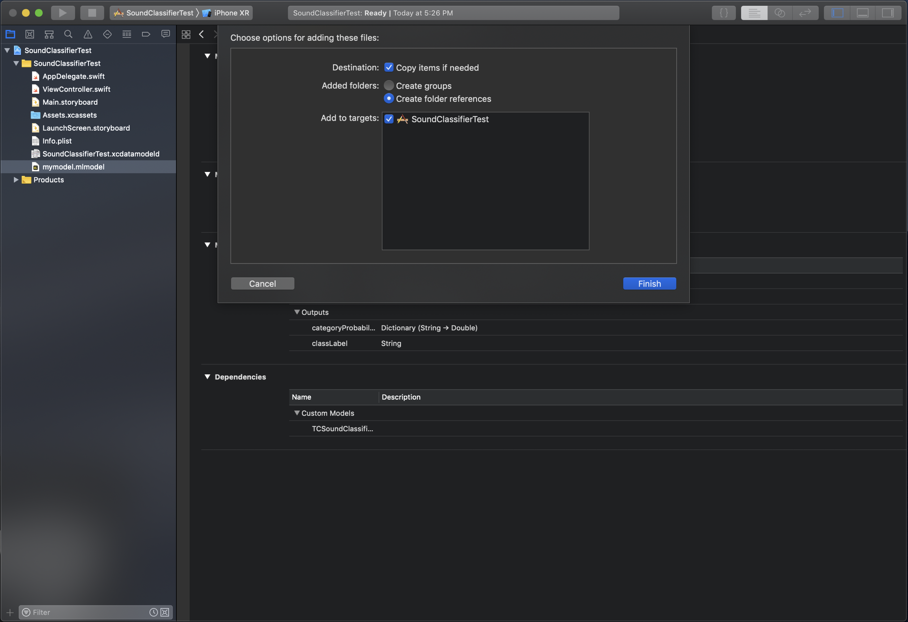

# Deployment to Core ML

***Note:*** *This functionality is only available on iOS 12+ and macOS 10.14+*

The Turi Create Sound Classifier Models are also available for use in
your iOS/macOS via exporting to Core ML. The exported Core ML model
will be a `PipelineClassifier` containing a model for each of the
three stages (see the [How it works section](../sound_classifier/how-it-works.md) for more details about the stages).

After creating your model in Turi Create, export it to Core ML format by calling `export_coreml` method as follows:
```python
my_sound_classifier.export_coreml("my_sound_classifier.mlmodel")
```

Then drag and drop the resulting mlmodel file into your Xcode project.
It should look something like this:


Before you can use the model you must download
`libAudioPreprocessing.dylib`. This is file is needed for the signal
preprocessing stage, which is implemented as a Core ML custom model.
The `libAudioPreprocessing.dylib` file can be found on the
[Github releases page](https://github.com/apple/turicreate/releases).
Once you've download that file, drag and drop it into your Xcode project.
The dialog box should look like:


Now, do the following:
* Under **Project > Build Phases**, add `libAudioPreprocessing.dylib` to **Copy Bundle Resources**
* Under **Project > General**, add `libAudioPreprocessing.dylib` to **Embedded Binaries** and to **Linked Frameworks and Libraries**


Now you are ready to start using your model. To create an instance of
your model simply do the following:
```swift
let model = my_sound_classifier()
```

The input to this model is an `MLMultiArray` of length 15,600 this is
975ms of data at a sample rate of 16K per second (.975 * 16,000 = 15,600).
The input must also only be one channel (i.e. mono not stereo). It is
important that the input to the model be 15,600 elements of one channel
data at a 16k sample rate.

In order get predictions from your model, you will need to chuck your
data into the correct size. Below is an example of doing that:
```swift
// Read wav file
var wav_file:AVAudioFile!
do {
   wav_file = try AVAudioFile(forReading:audioFilename)
} catch {
   fatalError("Could not open wav file.")
}

print("wav file length: \(wav_file.length)")
assert(wav_file.fileFormat.sampleRate==16000.0, "Sample rate is not right!")

let buffer = AVAudioPCMBuffer(pcmFormat: wav_file.processingFormat, frameCapacity: UInt32(wav_file.length))
do {
   try wav_file.read(into:buffer!)
} catch{
   fatalError("Error reading buffer.")
}
guard let bufferData = try buffer?.floatChannelData else {
   fatalError("Can not get a float handle to buffer")
}

// Chunk data and set to CoreML model
let windowSize = 15600
guard let audioData = try? MLMultiArray(shape:[windowSize as NSNumber], dataType:MLMultiArrayDataType.float32) else {
   fatalError("Can not create MLMultiArray")
}

// Ignore any partial window at the end.
var results = [Dictionary<String, Double>]()
let windowNumber = wavFile.length / Int64(windowSize)
for windowIndex in 0..<Int(windowNumber) {
   let offset = windowIndex * windowSize
   for i in 0...windowSize {
      audioData[i] = NSNumber.init(value: bufferData[0][offset + i])
   }
   let modelInput = modelInput(audio: audioData)

   guard let modelOutput = try? model.prediction(input: modelInput) else {
      fatalError("Error calling predict")
   }
   results.append(modelOutput.labelProbability)
}
```

Once all window predictions are saved, to generate the overall
prediction, calculate the mean across all prediction windows:
```swift
// Average model results from each chunk
var prob_sums = Dictionary<String, Double>()
for r in results {
    for (label, prob) in r {
        prob_sums[label] = (prob_sums[label] ?? 0) + prob
    }
}

var max_sum = 0.0
var max_sum_label = ""
for (label, sum) in prob_sums {
    if sum > max_sum {
       max_sum = sum
       max_sum_label = label
    }
}

let most_probable_label = max_sum_label
let probability = max_sum / Float(results.count)
print("\(most_probable_label) predicted, with probability: \(probability)")
```
