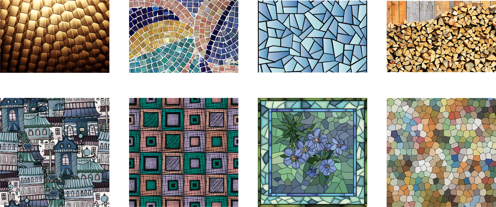
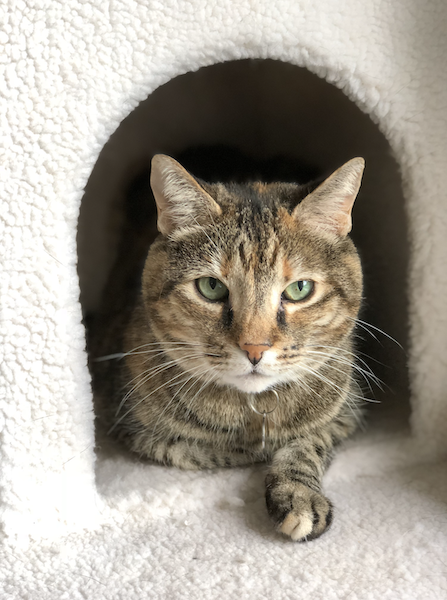
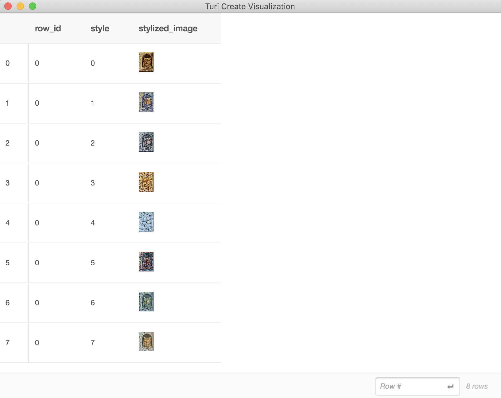

# Style Transfer

Style Transfer is a task wherein the stylistic elements of a style image
are imitated onto a new image while preserving the content of the new
image. As an example, a style transfer model that uses these [style
images](#style-images) when applied to this [content image](#content-image) 
results in:


The training procedure for style transfer requires the following data:
- Content images: A set of representative images in your application
- Style images: A set of style image(s) you would like to learn


#### Introductory Example

Here is a simple end-to-end example of using style transfer.

```python
import turicreate as tc

# Load the style and content images
styles = tc.load_images('style/')
content = tc.load_images('content/')

# Create a StyleTransfer model
model = tc.style_transfer.create(styles, content)

# Load some test images
test_images = tc.load_images('test/')

# Stylize the test images
stylized_images = model.stylize(test_images)

# Save the model for later use in Turi Create
model.save('mymodel.model')

# Export for use in Core ML
model.export_coreml('MyStyleTransfer.mlmodel')
```

#### Data Acquisition

As described before, style transfer models require style images. Some
examples include paintings, textured images, colorful mosaics as found
in [istock](https://www.istockphoto.com/), [NGA
IMAGES](https://images.nga.gov/en/page/openaccess.html), [MET
Museum](https://www.metmuseum.org/art/) and others. Here are a few style
images from [istock](https://www.istockphoto.com/) that contain unique
stylistic elements that can create interesting effects.

##### Style Images


In addition to style images, we also require some content images. These
images can be *any images* that could represent the type of content you
might see in your application. As an example, if your application
involves a lot of selfies, then using selfies as content images, in the
training process, can result in better models.

##### Content Image



#### Model Creation

Model creation may take time. If you do not have access to a GPU, it can
take up to a day or more to train a good model for one style image. The number of training
iterations is determined automatically. You may lower this value to make
model creation faster, as the cost of obtaining a potentially worse
model. See [how it works](how-it-works.md) for more details on how this
model works and some more details on advanced options available to you.

#### Using GPUs

Style transfer model training can be accelerated on Linux using NVIDIA GPUs. To setup GPU training, 
[see instructions here](https://github.com/apple/turicreate/blob/master/LinuxGPU.md). Training on Mac GPUs is currently not supported.


#### Creating stylized images

Once your model is created, you can test by stylizing some new images
that are not seen during the model creation process.

```python
stylized_images = model.stylize(test_images)
```
For a model with 8 styles, the output looks like this:
```no-highlight
+--------+-------+------------------------+
| row_id | style |     stylized_image     |
+--------+-------+------------------------+
|   0    |   0   | Height: 256 Width: 256 |
|   0    |   1   | Height: 256 Width: 256 |
|   0    |   2   | Height: 256 Width: 256 |
|   0    |   3   | Height: 256 Width: 256 |
|   0    |   4   | Height: 256 Width: 256 |
|   0    |   5   | Height: 256 Width: 256 |
|   0    |   6   | Height: 256 Width: 256 |
|   0    |   7   | Height: 256 Width: 256 |
+--------+-------+------------------------+
[8 rows x 3 columns]
```

We can visually explore these results using `stylized_images.explore()`:



By default `stylize` will apply all the styles of the model to each of the
input images. You can also stylize using selected styles by setting the
`style` parameter. Here are some examples:

```python
# Only the first style
stylized_image = model.stylize(test_images, style=0)

# A subset of styles
stylized_images = model.stylize(test_images, style=[1, 2])
```

By default, images with any one side larger than 800px are scaled down
(preserving aspect ratio) so that the largest side of an image is less
than 800px. You can adjust this using the `max_size` parameter:

```python
stylized_images = model.stylize(test_images, max_size=1024)
```

It is not always the case that stylizing your images at the highest
possible resolution will produce the desired effect on your image so we
recommend you choose this based on your styles and the desired effect
you'd like it to have. The larger the size, the more computationally
expensive it is to stylize (without resizing). Please refer to the [api
docs](https://apple.github.io/turicreate/docs/api/generated/turicreate.style_transfer.StyleTransfer.stylize.html#turicreate.style_transfer.StyleTransfer.stylize)
for more details.

The styles are stored inside the model as an SFrame. You can retrieve it
using:
```python
my_styles = model.styles
```
```no-highlight
Columns:
    style   int
    image   Image

Rows: 4

Data:
+-------+--------------------------+
| style |          image           |
+-------+--------------------------+
|  0    |  Height: 642 Width: 642  |
|  1    |  Height: 642 Width: 642  |
|  2    |  Height: 642 Width: 642  |
|  3    |  Height: 642 Width: 642  |
+-------+--------------------------+
```
