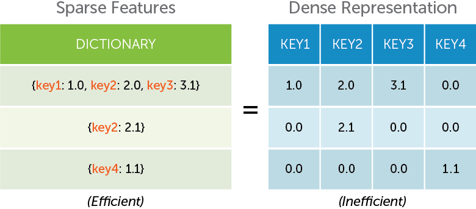

#Linear Regression

Turi Create's [linear
regression](https://apple.github.io/turicreate/docs/api/generated/turicreate.linear_regression.LinearRegression.html)
module is used to predict a continuous **target** as a linear function
of **features**. This is a two-stage process, analogous to many other
Turi toolkits. First a model is created using **training data**. Once
the model is created, it can then be used to make predictions on new
examples that were not seen in training (the  **test data**). Model
creation, prediction, and evaluation work will data that is contained in
an SFrame. The following figure illustrates how linear regression works.
Notice that the functional form learned here is a linear function
(unlike the previous figure where the predicted function was
non-linear).

<div id="linregr-plot"></div>
<script src="images/linregr-plot.js"></script>

##### Background

Given a set of features $$x_i$$, and a label $$y_i$$ (where $$i$$
denotes a single example in the training data), linear regression
assumes that the target $$y_i$$ is a linear combination of the features
$$x_i$$ i.e

$$
    y_i = f_i(\theta) =  \theta^T x + \epsilon_i
$$

where $$\epsilon_i$$ is random Gaussian noise with mean $$0$$ and
variance $$\sigma$$.  **An intercept term** is added by appending a
column of 1's to the features.  Regularization is often required to
prevent over-fitting by penalizing models with extreme parameter values.
The linear regression module supports L1 and L2
[regularization](http://en.wikipedia.org/wiki/Regularization_%28mathematics%29),
which are added to the loss function.

The composite objective being optimized for is the following:

$$
    \min_{\theta} \sum_{i = 1}^{n} (\theta^Tx - y_i)^2 + \lambda_1 \|\theta\|_1 + \lambda_2 \|\theta\|_2^2
$$


where $$\lambda_1$$ is the ``l1_penalty`` and $$\lambda_2$$ is the ``l2_penalty``.

##### Introductory Example

Suppose we have a dataset containing restaurant reviews. The
task is to **predict the 'star rating' for a restaurant for a given
user**.

We will first split the data into a train-test split and then create a linear
regression model that can predict the **star rating** for each review using:

* Average rating of a given business
* Average rating made by a user
* Number of reviews made by a user
* Number of reviews that concern a business

```python
import turicreate as tc

# Load the data
data =  tc.SFrame('ratings-data.csv')

# Make a train-test split
train_data, test_data = data.random_split(0.8)

# Create a model.
model = tc.linear_regression.create(train_data, target='stars',
                                    features = ['user_avg_stars',
                                                'business_avg_stars',
                                                'user_review_count',
                                                'business_review_count'])

# Save predictions to an SFrame (class and corresponding class-probabilities)
predictions = model.predict(test_data)

# Evaluate the model and save the results into a dictionary
results = model.evaluate(test_data)
```

##### Additional Features

We will now go over some more advanced options with the linear regression
module. This includes regularization, evaluation options, model interpretation,
and missing value handling.  Note that **logistic regression and support vector
machines (SVM)** conform to **almost** all of the API discussed below.

######  <a name="linregr-model-access"></a> Accessing attributes of the model

The attributes of all Turi Create models, which include training statistics, model
hyper-parameters, and model results can be accessed in the same way as python
dictionaries.

###### <a name="linregr-interpreting-results"></a> Interpreting results

Linear regression can provide valuable insight about the relationships between
the target and feature columns in your data, revealing why your model returns
the predictions that it does. The **coefficients** ($$\theta$$) are what the
training procedure learns. Each model coefficient describes the expected change
in the target variable associated with a unit change in the feature. The bias
term indicates the "inherent" or "average" target value if all feature values
were set to zero.

The coefficients often tell an interesting story of how much each feature
matters in predicting target values. The magnitude (absolute value) of the
coefficient for each feature indicates the strength of the feature's association
to the target variable, **holding all other features constant**. The sign on the
coefficient (positive or negative) gives the direction of the association.

When a Turi Create regression model is trained, the `model.summary()` output
shows the largest positive and negative coefficients. After a model is
created, we can access the coefficients as follows:

```python
coefs = model['coefficients']
print coefs
```
```no-highlight
+-----------------------+-------+-------------------+-------------------+
|          name         | index |       value       |       stderr      |
+-----------------------+-------+-------------------+-------------------+
|      (intercept)      |  None |   -2.22993154648  |  0.0199750718984  |
|     user_avg_stars    |  None |   0.809669227421  |  0.00414406824672 |
|   business_avg_stars  |  None |   0.781099022798  |  0.00419064940637 |
|   user_review_count   |  None | 1.85023282568e-05 | 1.15481783547e-05 |
| business_review_count |  None | 7.06842770902e-05 | 1.72332966093e-05 |
+-----------------------+-------+-------------------+-------------------+
[5 rows x 3 columns]
```

Note that the **index** column in the coefficients is only applicable for
categorical features, lists, and dictionaries. In the SFrame above, there is an
extra column for `standard errors` on the estimated coefficients (see section
below for a more detailed explanation).

###### <a name="linregr-stderr"></a> Standard-errors

The standard error is the empirical standard deviation on the estimated
coefficient. For example, a coefficient of 1 with a standard error of 0.5
implies a standard deviation of 0.5 on the estimated values of the
coefficients. Standard errors capture the `confidence` we have in the
coefficients estimated during model creation. Smaller standard errors implies
more confidence in the value of the coefficients returned by th model.

Standard errors on coefficients are only available when `solver=newton` or
when the default `auto` solver option choses the newton method and if the
number of examples in the training data is more than the number of
coefficients. If standard errors cannot be estimated, a column of `None` values
are returned.


######  <a name="linregr-categorical-features"></a> Categorical features

Categorical variables are features that can take one of a limited, and usually
fixed, number of possible values. Each category is referred to as a level. As an
example, consider the variable **city** that a given restaurant is in. This
dataset has about 60 unique strings for the **city** (the number of unique
values in the output of Turi Canvas is approximate).

```
city = train_data['city']
city.show()
```


The regression module in Turi Create uses **simple encoding** while
creating models using string features. Simple encoding compares each category
to an arbitrary reference category (we choose the first category of the data as
the reference).  In other words, we add *dummy coefficients* to encode each
category.  The number of these dummy coefficients is equal to the total number
of categories minus 1 (for the reference category). The following figure
illustrates how categorical variables are encoded using the **simple encoding**
scheme.

[](images/supervised-learning-categorical-variable-encoding.png)


Now let us look at a simple example of using **city** as a variable in the
linear regression model. Notice that there is no need to do any special
pre-processing. All SFrame columns of type **str** are automatically
transformed into categorical variables. Notice that the **number of
coefficients** and the **number of features** aren't the same.


In this example, there are 60 unique cities, so 59 dummy
coefficients. Turi Create can handle categorical variables with
**millions** of categories.

```python
# Create a model with categorical features.
model = tc.linear_regression.create(train_data, target='stars',
                                    features = ['user_avg_stars',
                                                'business_avg_stars',
                                                'user_review_count',
                                                'business_review_count',
                                                'city'])

# Number of feature columns
print "Number of features          : %s" % model['num_features']

# Number of features (including expanded lists and dictionaries)
print "Number of unpacked features : %s" % model['num_unpacked_features']

# Number of coefficients in the model
print "Number of coefficients      : %s" % model['num_coefficients']

# A coefficient is included for each category
print model['coefficients']
```
```no-highlight
Number of features          : 5
Number of unpacked features : 5
Number of coefficients      : 64

+-----------------------+------------+-------------------+
|          name         |   index    |       value       |
+-----------------------+------------+-------------------+
|      (intercept)      |    None    |   -2.23521785747  |
|     user_avg_stars    |    None    |   0.812827992012  |
|   business_avg_stars  |    None    |   0.778447236096  |
|   user_review_count   |    None    | 2.48618619187e-05 |
| business_review_count |    None    | 0.000102740183746 |
|          city         |   Tempe    |  -0.0214425060978 |
|          city         | Scottsdale | -0.00858553630484 |
|          city         |    Mesa    |  0.0109508448699  |
|          city         |  Chandler  |  0.0390579171569  |
|          city         |  Gilbert   | -0.00525039510189 |
|          ...          |    ...     |        ...        |
+-----------------------+------------+-------------------+
[64 rows x 3 columns]

Note: Only the head of the SFrame is printed.
You can use print_rows(num_rows=m, num_columns=n) to print more rows and columns.

```


######  <a name="linregr-sparse-features"></a> Sparse features

Sparsity is one of the most important things to consider when working with
a lot of data. Sparse features are encoded using a dictionary where the keys
represent the feature names and the values are the feature values.
A coefficient is added for each key in the union of the set of keys for all
dictionaries across all examples. For a particular example, only non-zero
values need to be stored in the dictionary.  The following illustration
describes how Turi Create dictionary features leverage sparsity in your
data.

[](images/supervised-learning-dictionary-variables.png)

Often, the sparse representation using dictionaries is much more efficient than
using the dense representation.


Reviews contain useful tags that describe each business. Unlike
categorical variables, a business may have several tags. These tags are stored
using dictionaries.  **Not all tags** are associated with every restaurant, so
we will only store those tags that are associated with restaurant and assume
that all tags **not explicitly provided are treated as features with value
zero**. We illustrate with the following example:

```python
print train_data['categories_dict'].head(3)
[{'Breakfast & Brunch': 1, 'Restaurants': 1},
 {'Restaurants': 1, 'Pizza': 1, 'Italian': 1},
 {'Dog Parks': 1, 'Parks': 1, 'Active Life': 1}]
```


We can now create a linear regression model with **categories_dict** included
in the feature list. A coefficient is added for each key encountered in the
input data. If the test data contains keys that were not present during
training, they are silently ignored.


```python
# Create a model with dictionary features.
model = tc.linear_regression.create(train_data, target='stars',
                                    features = ['user_avg_stars',
                                                'business_avg_stars',
                                                'user_review_count',
                                                'business_review_count',
                                                'categories_dict'])

# Number of feature columns
print "Number of features          : %s" % model['num_features']

# Number of features (including expanded lists and dictionaries)
print "Number of unpacked features : %s" % model['num_unpacked_features']

# Number of coefficients in the model
print "Number of coefficients      : %s" % model['num_coefficients']

# A coefficient is included for each key in the dictionary
print model['coefficients']
```
```no-highlight
Number of features          : 5
Number of unpacked features : 511
Number of coefficients      : 512

+-----------------------+--------------------+--------------------+
|          name         |       index        |       value        |
+-----------------------+--------------------+--------------------+
|      (intercept)      |        None        |   0.872679609626   |
|     user_avg_stars    |        None        |   0.415478142682   |
|   business_avg_stars  |        None        |   0.363118585079   |
|   user_review_count   |        None        | -1.13051967735e-05 |
| business_review_count |        None        | 0.000205358202417  |
|    categories_dict    | Breakfast & Brunch |  -0.120010958039   |
|    categories_dict    |    Restaurants     |   0.271655570815   |
|    categories_dict    |   Middle Eastern   |  -0.229361372902   |
|    categories_dict    |     Dog Parks      |  -0.509799508435   |
|    categories_dict    |       Parks        |  -0.0565527745702  |
|          ...          |        ...         |        ...         |
+-----------------------+--------------------+--------------------+
[512 rows x 3 columns]
Note: Only the head of the SFrame is printed.
You can use print_rows(num_rows=m, num_columns=n) to print more rows and columns.
```

######  <a name="linregr-list-features"></a> List features

Turi Create can also handle list of numerical values as features without
preprocessing. The following illustration shows that the numeric-list feature
is equivalent to adding several columns for each individual feature. This is
especially useful for image data where the number of features generated are
large and may not have natural interpretations. The following figure
illustrates this idea.

[](images/supervised-learning-list-variables.png)

As an example, we convert the **votes** (which stores the number of *cool*,
*funny*, and *useful* votes for each review) column into a list of features for
each vote type.

```python
from array import array

# List of features
train_data['votes_list'] = train_data['votes'].apply(lambda x: x.values())
print train_data['votes_list'].head(3)
[array('d', [0.0, 5.0, 2.0]),
 array('d', [0.0, 0.0, 0.0]),
 array('d', [0.0, 2.0, 1.0])]
```

**Notice** that the SArray of numeric lists must be of dtype **array** and the
array in each row must be **of the same length**. The `astype()` function of
the SArray can help convert your data from type `array` to `list`.

```python
# Create a model with numeric-list features.
model = tc.linear_regression.create(train_data, target='stars',
                                    features = ['user_avg_stars',
                                                'business_avg_stars',
                                                'user_review_count',
                                                'business_review_count',
                                                'votes_list'])


# Number of feature columns
print "Number of features          : %s" % model['num_features']

# Number of features (including expanded lists and dictionaries)
print "Number of unpacked features : %s" % model['num_unpacked_features']

# Number of coefficients in the model
print "Number of coefficients      : %s" % model['num_coefficients']

# A coefficient is included for each index in the list
print model['coefficients']
```
```no-highlight
Number of features          : 5
Number of unpacked features : 7
Number of coefficients      : 8

+-----------------------+-------+-------------------+
|          name         | index |       value       |
+-----------------------+-------+-------------------+
|      (intercept)      |  None |   -2.02163219079  |
|     user_avg_stars    |  None |   0.792122828319  |
|   business_avg_stars  |  None |   0.756871316569  |
|   user_review_count   |  None | 3.46394815858e-06 |
| business_review_count |  None | 7.55781795366e-05 |
|       votes_list      |   0   |  -0.0919094290658 |
|       votes_list      |   1   |  -0.113808771262  |
|       votes_list      |   2   |   0.201216924886  |
+-----------------------+-------+-------------------+
[8 rows x 3 columns]
```

######  <a name="linregr-feature-rescaling"></a> Feature rescaling

Feature rescaling is the process of scaling individual features to be of the
same scale. This process is particularly useful when features vary widely in
their ranges. It is well known that **feature rescaling can make an enormous
impact on accuracy**. By default, Turi Create rescales all the features to
make sure that they have the same L2-norm.  The data is **not centered** to
make each column of mean zero.  Categorical features, lists, and sparse
features (dictionaries), are also rescaled columnwise. The feature rescaling
can be disabled (**only recommended for advanced users**) by setting
``feature_rescaling = False``. The **coefficients are scaled back to the
original scale of the problem**.


```python
model = tc.linear_regression.create(train_data, target='stars',
                                    features = ['user_avg_stars',
                                                'business_avg_stars',
                                                'user_review_count',
                                                'business_review_count'],
                                    feature_rescaling = False)
```


######  <a name="linregr-solver"></a> Choosing the solver

The optimization used to create the model is automatically picked based on the input data from a carefully engineered collection
of methods. The newton
method works best for datasets with plenty of examples and few features (long
datasets). Limited memory BFGS (``lbfgs``) is a robust solver for wide datasets
(i.e datasets with many coefficients). ``fista`` is the default solver for
L1-regularized linear regression. Gradient-descent (GD) is another well tuned
method that can work really well on L1-regularized problems. The **solvers are
all automatically tuned** and the **default options should function well**.
Solver options can, however, be changed.  In this example, we will increase
``max_iterations`` to 20 iterations. This is useful when
``model['solver_status']`` is ``TERMINATED: Iteration limit reached`` and the
accuracy of the model is not at a desired level.


```python
# Provide solver options in a dictionary
model = tc.linear_regression.create(train_data, target='stars',
                                    features = ['user_id',
                                                'business_id',
                                                'user_avg_stars',
                                                'business_avg_stars'],
                                    solver = 'lbfgs',
                                    max_iterations = 20)
```

** What happens when the default solver fails?**

Whenever you have convergence trouble and the number of features is < 5000, then
``solver``=`newton` is a good choice. The Newton method is one of the most
stable optimization methods and works quite well if you have few coefficients.
The downside of the Newton method is its large computational complexity per-
iteration.

**Solver options guide**

Most solvers are all automatically tuned and the default options should function
well. Changing the default settings may help in some cases.

* ``step_size``: The starting step size to use for the ``fista`` and ``gd``
solvers. The default is set to 1.0, this is an aggressive setting. If the first
iteration is taking a considerable amount of time, then reducing the step size
may speed up model training. If the step size of 1.0 is accepted in the first
iteration, then consider increasing this step size to a more aggressive value.


* `max_iterations` : The maximum number of passes through the data allowed.
Increasing his can result in a more accurately trained model. Consider
increasing this (the default value is 10) if the training accuracy is low and
the *Grad-Norm* in the display is large.


* `convergence_threshold`: Convergence is tested using variation in the training
objective. The variation in the training objective is calculated by dividing the
difference between the objective values between two steps. Consider reducing this
below the default value (0.01) for a better training data fit. Beware of
[overfitting](http://en.wikipedia.org/wiki/Overfitting) (i.e a model that works well only on the training data) if this
parameter is set to a very low value.


* ``lbfgs_memory_level``: The L-BFGS algorithm keeps track of gradient
information from the previous ``lbfgs_memory_level`` iterations. The storage
requirement for each of these gradients is the ``num_coefficients`` in the
problem. Increasing the ``lbfgs_memory_level ``can help improve the quality of
the model trained at the cost of more memory. Setting this to more than
``max_iterations`` has the same effect as setting it to ``max_iterations``.

###### Making predictions with missing data

Once the model is created and ready to make predictions, it is quite common
that the input data to make predictions on are noisy. Turi Create can
recognize the following types of missing data (stored as **None**). Note that
the following options only apply to **missing values during prediction or
evaluation**. Missing values during model creation raise an error.

* **Missing values in individual features**: Individual features including
numerical, categorical, list of numeric, and dictionary features may contain
missing data. The option ``missing_value_action`` determines the way in which
these features are handled. The **default value** value is
``missing_value_action='impute'`` which imputes each of the features to the mean
value observed during training. Setting ``missing_value_action='error'`` throws
an error if any missing values are encountered during prediction.


* **Missing feature columns**: Sometimes, an entire column is missing while
making predictions. In this case, ``missing_value_action='impute'`` imputes the
mean value observed during training for each row in the input data. Again,
setting ``missing_value_action='error'`` throws an error if an entire feature
column is missing during prediction.


* **New categories in categorical features**: New categories are often observed
during predict time. These new categories are treated to be the same as the
reference category thus having no effect on the model prediction.


* **New keys in dictionary features**: New keys in dictionary features during
predict time are silently ignored and do not effect the prediction made.


```python
# Create a model with categorical and dictionary features.
model = tc.linear_regression.create(train_data, target='stars',
                                    features = ['user_avg_stars',
                                                'business_avg_stars',
                                                'user_review_count',
                                                'business_review_count',
                                                'city',
                                                'categories_dict'])

# An SFrame with a single row with missing values in the 'user_avg_stars'
# predict() will impute the entire feature to the mean value observed during training
new_data = tc.SFrame({'user_avg_stars': [None],
                      'business_avg_stars': [30.0],
                      'user_review_count': [10],
                      'business_review_count': [20],
                       'city': ['Tuscon'],
                       'categories_dict': [{'Pizza': 1}]
                      })
prediction = model.predict(new_data)
print prediction

# An SFrame without the 'user_avg_stars' feature. predict() will impute the
# entire feature to the mean value observed during training.
new_data = tc.SFrame({'business_avg_stars': [30.0],
                      'user_review_count': [10],
                      'business_review_count': [20],
                       'city': ['Tuscon'],
                       'categories_dict': [{'Pizza': 1}]
                      })
prediction = model.predict(new_data)
```

######  <a name="linregr-regularizer"></a> Regularizing Models (Lasso, Ridge, and Elastic Net regression)

Regularization is the process of using problem structure to solve ill-posed
problems or to prevent overfitting. The structure is imposed by adding a penalty
term to the objective function. The linear regression module supports L1 and L2
regularization, which are added to the loss function.

As discussed above, the composite objective being optimized for is the
following:
$$
    \min_{\theta} \sum_{i = 1}^{n} (\theta^Tx - y_i)^2 + \lambda_1 ||\theta||_1
+ \lambda_2 ||\theta||^2_2
$$

where $$\lambda_1$$ is the `l1_penalty` and $$\lambda_2$$ is the `l2_penalty`.


```python
# Lasso
model = tc.linear_regression.create(train_data, target='stars',
                                    features = ['user_avg_stars',
                                                'business_avg_stars',
                                                'user_review_count',
                                                'business_review_count'],
                                    l1_penalty = 1.0,
                                    l2_penalty = 0.0)

# Ridge regression
model = tc.linear_regression.create(train_data, target='stars',
                                    features = ['user_avg_stars',
                                                'business_avg_stars',
                                                'user_review_count',
                                                'business_review_count'],
                                    l2_penalty = 1.0)

# Elastic net regression
model = tc.linear_regression.create(train_data, target='stars',
                                    features = ['user_avg_stars',
                                                'business_avg_stars',
                                                'user_review_count',
                                                'business_review_count'],
                                    l1_penalty = 1.0,
                                    l2_penalty = 1.0)
```
