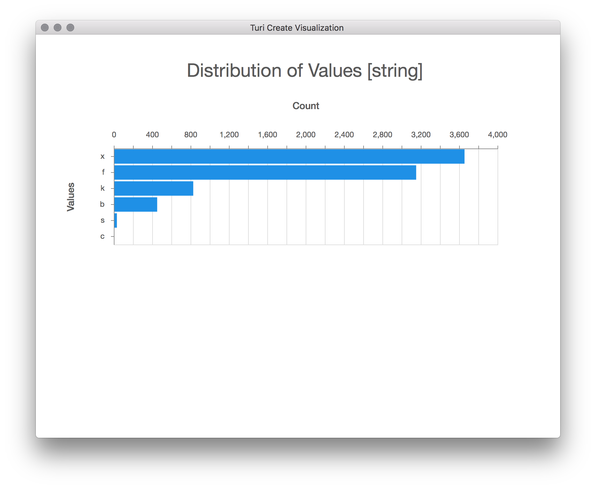
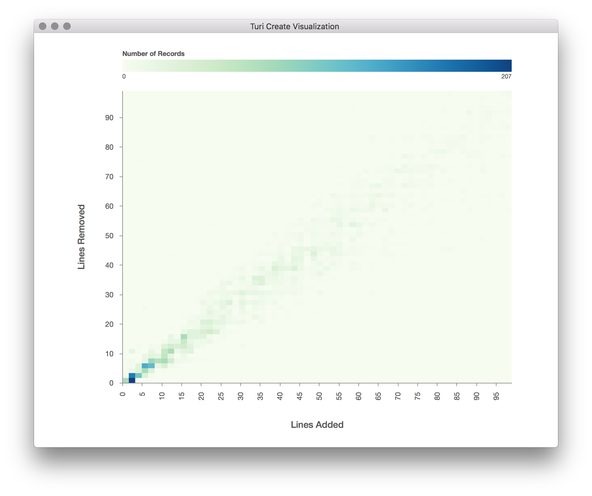

## Turi Create Visualization Gallery

Click on a thumbnail to see the code and a larger image.

<table>
  <tr>
    <td>
      <a href="#sframeshow"></a>
    </td>
    <td>
      <a href="#sframeexplore"></a>
    </td>
    <td>
      <a href="#sarrayshow-intfloat"></a>
    </td>
    <td>
      <a href="#sarrayshow-str"></a>
    </td>
  </tr>
  <tr>
    <td>
      <a href="#scatter-plot"></a>
    </td>
    <td>
      <a href="#numeric-heat-map"></a>
    </td>
    <td>
      <a href="#categorical-heat-map"></a>
    </td>
    <td>
      <a href="#box-plot"></a>
    </td>
  </tr>
</table>

#### Examples

##### SFrame.show

```python
# Summarizes and shows the summary of each column in sf
sf.show()
```


##### SFrame.explore

```python
# Opens an interactive exploration of the data in sf
sf.explore()
```


##### SArray.show (int/float)

```python
# Summarizes and shows the summary of a numeric SArray
sa.show(title='Normalized Lines Changed')
```


##### SArray.show (str)

```python
# Summarizes and shows the summary of a categorical SArray
sa.show()
```


##### Scatter plot

```python
# Assumes `sa1` and `sa2` are both numeric (int/float) SArrays <= 5,000 rows
turicreate.show(sa1, sa2, xlabel='Actual Change', ylabel='Predicted Change')
```


##### Numeric heat map

```python
# Assumes `sa1` and `sa2` are both numeric (int/float) SArrays > 5,000 rows
turicreate.show(sa1, sa2, xlabel='Lines Added', ylabel='Lines Removed')
```


##### Categorical heat map

```python
# Assumes `sa1` and `sa2` are both categorical (str) SArrays
turicreate.show(sa1, sa2, xlabel='Label', ylabel='Cap Shape')
```


##### Box plot

```python
# Assumes `sa1` is numeric (int/float) and `sa2` is categorical (str),
# or alternatively, `sa2` is numeric and `sa1` is categorical.
turicreate.show(sa1, sa2, xlabel='Based on Style', ylabel='Normalized Lines Changed')
```

