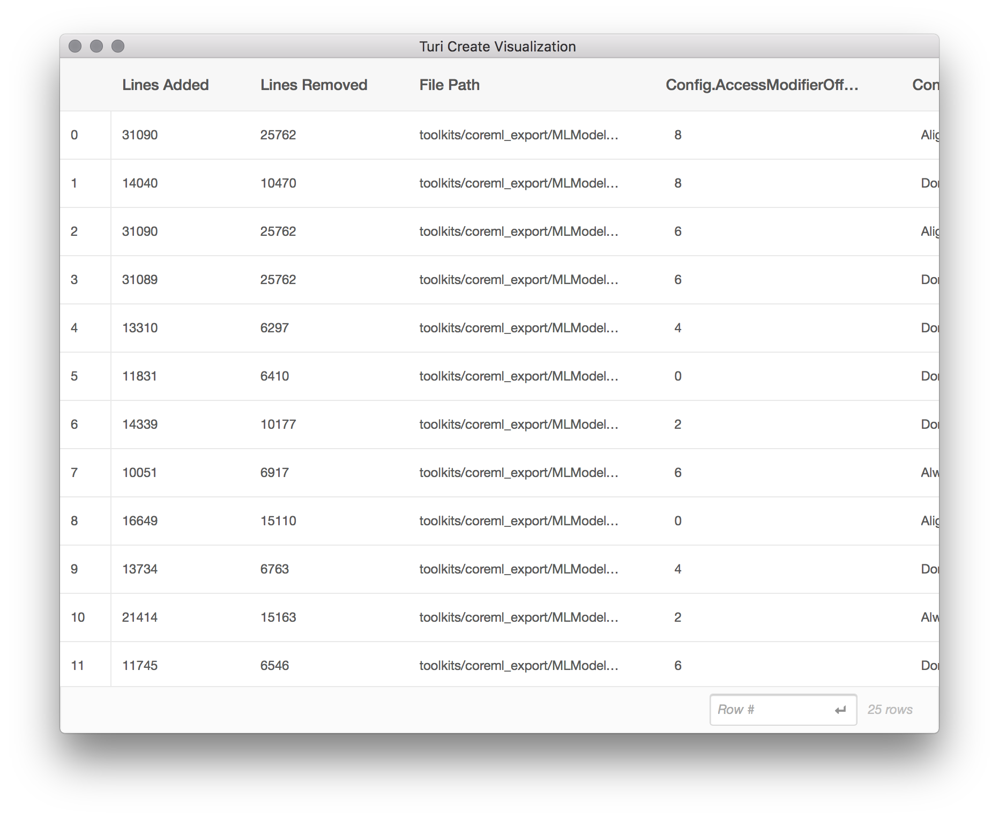
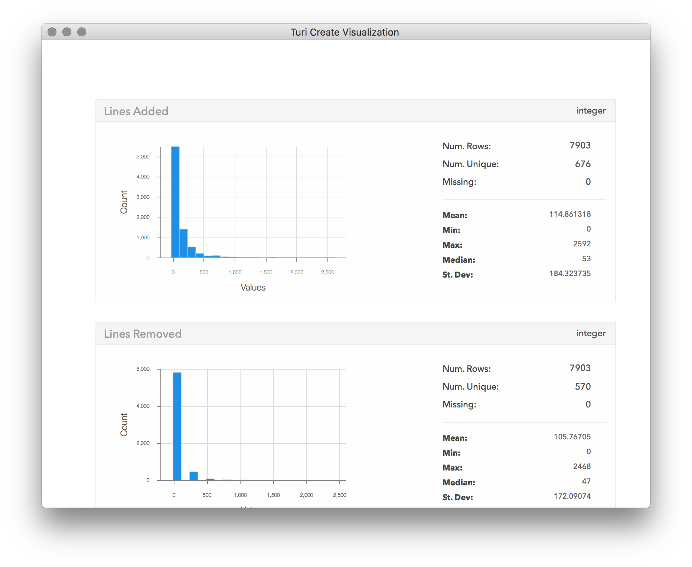
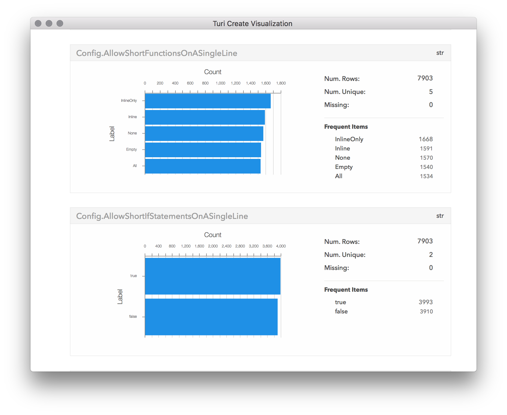

## Sample Use Cases for Visualization

In this chapter, we will use the `show` and `explore` methods to get insight
about a dataset to use it for a modeling problem.

#### Use case: automated code formatting

As a developer, I'd like to use automated tools to help me write code in the
same style as the code in the current Turi Create repository. One commonly used
code formatting tool is
[clang-format](https://clang.llvm.org/docs/ClangFormat.html). Since we don't
yet have a set of configuration options for the repository, we'll need to make
one.  We don't exactly know the right set of options up front, but we have
representative example data available in the form of the existing source code.
We can use machine learning to help solve this problem. The modeling problem
this chapter focuses on is to find the best fitting configuration of
`clang-format`, given the existing source code of Turi Create.

There are many possible configuration options, with many possible values, and
testing all of them would take a very long time. However, we can use a small
random sample of these configurations to model the ideal configuration, by
treating each `clang-format` configuration variable (like
`AlignAfterOpenBracket`) as an independent feature to a model. While exploring
how to model the formatting of the source code, we will see how visualizing raw
data, data aggregated across a single dimension, and data aggregated across two
dimensions can help us manipulate data and understand the behavior of a model.

#### Loading and exploring data

We'll start by loading the dataset and getting an overview of the data. There
are two useful methods on `SFrame` objects that can help us understand what we
just loaded:

* `explore` gives us a table view of rows and columns of raw data.
* `show` gives us an aggregated overview of each column in the dataset.

```python
sf = turicreate.SFrame.read_csv('https://docs-assets.developer.apple.com/turicreate/datasets/tc-clang-format-results.csv')
sf.explore()
```


The explore method opens a scrollable table of the raw data from `sf` arranged
in rows and columns. This dataset contains the following columns:

* `Lines Added` represents the number of lines that would be added, for this
  source file, for this clang-format configuration.  `Lines Removed` represents
  the number of lines that would be removed, per source file, for this
  configuration.
* `File Path` is the path to a file in the Turi Create source tree.
* Each column starting with `Config.` is a distinct clang-format configuration
  option. For example, `Config.BasedOnStyle` refers to the `BasedOnStyle`
  option in the
  [clang-format options](https://clang.llvm.org/docs/ClangFormatStyleOptions.html#configurable-format-style-options).
  There are 20 such columns.

Each line in this dataset is created by performing the following steps:

1. From the set of possible file paths under `src/unity`, sample a random file
   path. This becomes the `File Path` column.
2. From the set of possible
   [clang-format options](https://clang.llvm.org/docs/ClangFormatStyleOptions.html#configurable-format-style-options),
   sample a random combination of options. This becomes each of the 20
   `Config.` columns. Note that there are more than 20 `clang-format`
   configuration options available; to speed up this process, we are looking
   only at the first 20 options in alphabetical order.
3. Apply the set of options in step (2) to the file path in step (1), by running:

   ```bash
   clang-format -i $FILE_PATH
   ```

   The result of this command is not directly used in the dataset.

4. Determine the diff (in lines added and removed) resulting from step 3 by running:

   ```bash
   git diff --numstat
   ```

   The result of this command becomes the `Lines Added` and `Lines Removed`
   columns.

5. Revert the changes on disk using `git reset --hard`, and repeat for another
   row of data.

By having a quick look at the summarized data presented by the `show` method,
we can get a good sense if these columns are ready to be used as targets for
our model.  Typical problems in the data such as missing values, outliers and
skewed input values could be easily spotted, allowing us to quickly identify
the required cleaning steps.

```python
sf.show()
```


We can clearly see that in almost all of the config changes, only a few lines
of code were changed.  In fact, so few lines of code have changed, that almost
the entire distribution is stacked near 0 in the first bin. This suggests
[outliers](https://en.wikipedia.org/wiki/Outlier) are skewing the distribution,
so let's see what they are:

```python
sf[sf['Lines Added'] > 10000].explore()
```



From this subset of the data, we can tell that the files with a large (outlier)
number of lines added tend to come from `toolkits/coreml_export/MLModel`. Aha!
It turns out the MLModel directory is for exporting models in the Core ML model
format, and contains a large amount of generated code. Let's exclude it from
our analysis.

```python
mostly_generated_code = sf['File Path'].apply(lambda path: '/MLModel/' in path)
sf = sf[mostly_generated_code != 1]
sf.show()
```



Now we can have a proper look at the number of changes. It seems that most
cases only had a few lines changed. From here it looks to go down
exponentially, with only a few of the configurations leading to more than 500
lines changed, and almost none with more than 800 changes. By scrolling down in
the visualization window, we can also see the distributions of the other
columns:



#### Explore some features

The target of our model would be to optimize the number of lines changed,
regardless of whether they were deleted or added. Let's choose one config
parameter, and inspect how it correlates with our target of lines changed.  To
achieve this, we will use the `turicreate.show` method, that takes two columns
(SArrays) and plots one on each axis. The type of plot chosen by
`turicreate.show` is automatic, based on the underlying data types in each
SArray, and in this case we're going to get a [box
plot](https://en.wikipedia.org/wiki/Box_plot) because we are plotting a
categorical column with a numeric column.

```python
sf['Lines Changed'] = sf['Lines Added'] + sf['Lines Removed']
turicreate.show(sf['Config.BasedOnStyle'],
                sf['Lines Changed'],
                xlabel='Based on Style',
                ylabel='Lines Changed')
```


The box plot shows us the distribution of values on the Y axis ("Lines
Changed"), for each distinct categorical value on the X axis ("Based on
Style").  This type of plot shows a line representing the full range of the
data (from min to max), and a smaller rectangle within that line that
represents the range of the 2nd and 3rd quartiles (from 25% to 75%).  We can
see from this plot that the base style that gives the smallest change overall
in this sample data is either "Google" or "Chromium". It appears that in all of
the base styles, the majority of the files had only a few line changed, but
there were a few files in which thousands of lines have changed. Looking at
number of lines changed might be misleading, as long files would have more
changes even if the change itself wasn't significant. We should probably
normalize the "Lines Changed" measurement by file size. Now that we've noticed
this by visualizing this feature, let's go back and adjust in our dataset for
the length of the file.

```python
file_sizes = turicreate.SFrame.read_csv('https://docs-assets.developer.apple.com/turicreate/datasets/tc-clang-format-file-sizes.csv')
sf = sf.join(file_sizes, on='File Path', how='left')
sf['Normalized Lines Changed'] = sf['Lines Changed'] / sf['Lines in File']
turicreate.show(sf['Config.BasedOnStyle'],
                sf['Normalized Lines Changed'],
                xlabel='Based on Style',
                ylabel='Normalized Lines Changed')
```


Now we see a much better distribution of lines changed per base config. Now
that we've normalized by file size, let's take a look at the distribution of
lines changed across all configs once more, by calling the `show` method on the
"Normalized Lines Changed" column:

```python
sf['Normalized Lines Changed'].show(title='Normalized Lines Changed')
```


After eliminating outliers and normalizing for file size, the distribution of
lines changed starts to make more sense. Now we are ready to create a model.

#### Evaluate a model

Next, let's create a regression model using the data we have now, treating each
"Config." column as a feature of the model, and the "Normalized Lines Changed"
column as the target to predict. Once the model has been created, we can use it
to predict the normalized lines changed for a subset of the data. By plotting
that prediction against the actual normalized lines changed, we can then get a
visual feel for how well the model is performing.

```python
(train, test) = sf.random_split(0.9)
features = [c for c in sf.column_names() if c.startswith('Config.')]
model = turicreate.regression.create(train,
                                     target='Normalized Lines Changed',
                                     features=features)
test['Predicted Change'] = model.predict(test)
turicreate.show(test['Normalized Lines Changed'],
                test['Predicted Change'],
                xlabel='Actual Change',
                ylabel='Predicted Change')
```


There doesn't seem to be much correlation between the predicted and actual
changes; otherwise, all the points would seem to be close to a straight line,
and not just scattered about. It seems we'll need to go back and improve our
model. Perhaps more data will help, as the ~6,800 samples we ended up training
on is only a tiny fraction of the possible search space of configuration
values. We also only used a small fraction of the possible configuration
variables here, as more would require an even larger sample size.

We can see from this exercise that visualization provides a powerful way to
help us visually inspect our data, clean it up, prepare it for modeling, and
evaluate the quality of a model. With immediate and visual feedback on the
result of data transformation, manipulation, and prediction, you can create
better models, faster.
